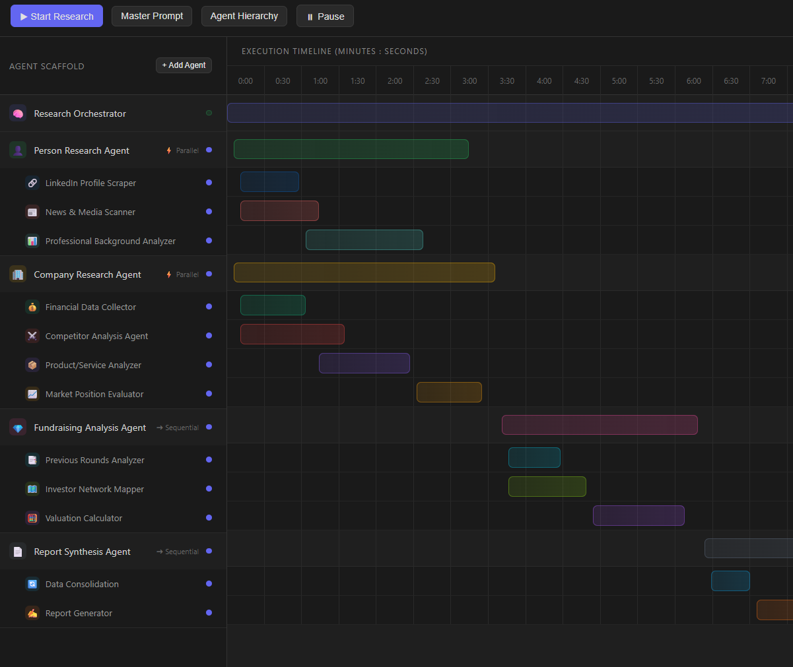
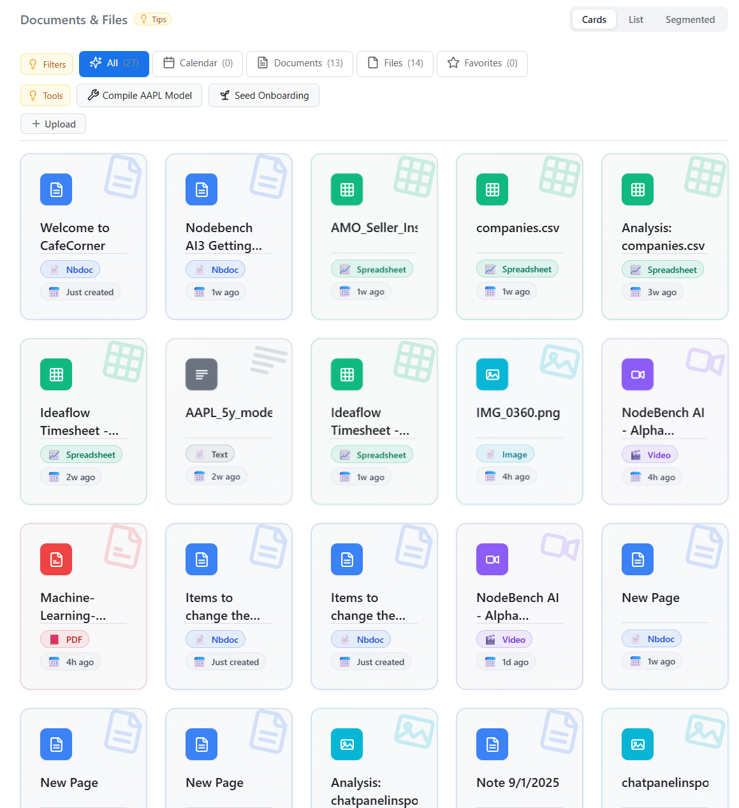
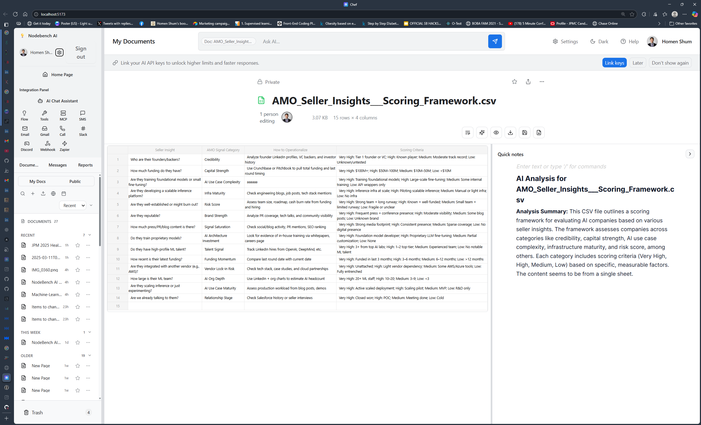

# Changelog

All notable changes to this project will be documented in this file.

## 2025-09-19

### Highlights
- UI refactor: Consolidated document and calendar views into Home Hub flows; removed legacy viewer pages.
- Layout & navigation: Streamlined MainLayout and TabManager; improved MiniEditorPopover UX.
- Files backend: Updated Convex file APIs for documents/files.
- Cleanup: Removed PublicDocuments, SpreadsheetView, WelcomePage and other legacy views.
- Chore: package.json updates.

### Details
- Removed legacy components
  - src/components/CalendarView.tsx
  - src/components/DocumentView.tsx
  - src/components/FileViewer.tsx
  - src/components/PublicDocuments.tsx
  - src/components/SpreadsheetView.tsx
  - src/components/WelcomePage.tsx
- Updated UI components
  - src/components/CalendarHomeHub.tsx; src/components/DocumentsHomeHub.tsx
  - src/components/DocumentGrid.tsx; src/components/FileSyncButton.tsx; src/components/FileTypeIcon.tsx
  - src/components/MCPManager.tsx; src/components/MainLayout.tsx; src/components/MiniEditorPopover.tsx; src/components/TabManager.tsx
  - src/components/editors/mini/SpreadsheetMiniEditor.tsx
- Backend (Convex)
  - convex/fileDocuments.ts; convex/files.ts – adjustments to file/document APIs and types.
- Misc
  - src/lib/metaPillMappers.ts tweaks; src/App.tsx update; package.json updated.

### AI Agent Timeline View

- Introduced a minimal TimelineGanttView with a new TimelineGanttPage wrapper for layout composition (timeline on left, notes/logs panel on right). DocumentView now mounts TimelineGanttPage for `documentType === "timeline"` or when a timeline bundle exists.
- Removed the obsolete TimelineGanttContainer (logic moved into TimelineGanttView and wrapper page).
- Added quick view buttons in the Home Hub Tools row to open Calendar and Timeline directly:
  - Calendar button switches the hub to calendar mode.
  - Timeline button opens your existing timeline doc if present, otherwise creates and seeds a new timeline doc, then navigates to it.
- Improved timeline document routing and card badges: timeline docs are labeled correctly and consistently open in the timeline view.
- Seed Timeline action in Tools creates a timeline, applies a demo plan, and navigates to it.

### Screenshots (091925)

AI Agent Timeline View (wrapper page + minimal timeline view):

### Screenshots (091825)

Updated homepage doc/filetype cards:

Better file viewer sizing:

File analysis prompt popover:

Updated spreadsheet view:

## 2025-09-17

### Highlights
- Analyze with Gemini: One-click file analysis inserts Markdown directly into Quick notes.
- Document header tags: AI-generated, color-coded by kind, inline rename, ghost “+ Add tag” pill, and kind change via left color strip.
- Backend support: New Convex mutations for tag removal and kind updates.

### Details
- File analysis → Quick notes
  - Added an “Analyze with Gemini” button in the File Viewer that calls the Convex action `fileAnalysis.analyzeFileWithGenAI` and inserts the Markdown result directly into the right-hand Quick notes editor.
  - Removed the old inline “AI Analysis” panel beneath the viewer.

- Tags in the document header
  - Generate Tags (Gemini) with loading state and permissions; header auto-runs tag generation after analysis via a `nodebench:generateTags` CustomEvent.
  - Tag pills are color-coded by kind (keyword, entity, topic, community, relationship). Kind is inferred from the AI output and canonicalized in the backend.
  - Click the left color strip on a pill to change its kind; click the pill text to rename inline; click × to remove.
  - Replaced the text input and kind dropdown with a “ghost” add pill (+ Add tag) that turns into an inline input.

- Backend (Convex)
  - New: `tags.removeTagFromDocument(documentId, tagId)` to detach a tag from a document.
  - New: `tags.updateTagKind(documentId, tagId, kind?)` to set/canonicalize a tag’s kind and refresh the document’s tag list.
  - Existing: `tags.addTagsToDocument` and `tags_actions.generateForDocument` are used by the header and auto-generate flows.

### Screenshots (091725)

AI analysis result added to Quick notes:

AI analysis plus AI-tagged header pills:

