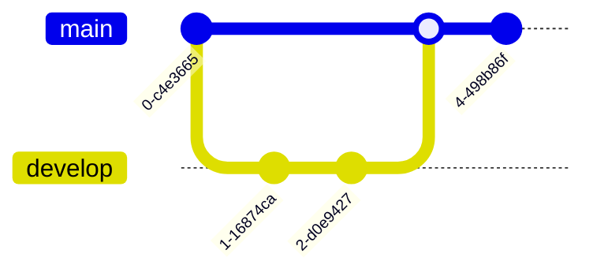

# Mermaid Diagrams in Fast Agent Panel

## Overview
The Fast Agent Panel now supports rendering **Mermaid diagrams** directly in chat! The AI can generate flowcharts, sequence diagrams, class diagrams, and more using simple text-based syntax.

## ✅ What's Been Added

### 1. **Mermaid Rendering** (`MermaidDiagram.tsx`)
- Automatically detects ```mermaid code blocks
- Renders them as beautiful SVG diagrams
- Error handling with helpful messages
- Loading states

### 2. **Integration** (`FastAgentPanel.UIMessageBubble.tsx`)
- Detects `language-mermaid` in code blocks
- Passes to MermaidDiagram component
- Works alongside regular code highlighting

### 3. **Agent Instructions** (Fast Agent Panel backend)
- AI knows it can create Mermaid diagrams
- Trained on Mermaid syntax
- Provides examples automatically

## 🎨 Supported Diagram Types

### Flowcharts


### Sequence Diagrams


### Class Diagrams


### State Diagrams


### Entity Relationship Diagrams


### Gantt Charts


### Pie Charts


### Git Graph


## 📖 How to Use

### For Users

**Ask the AI to create a diagram:**
- "Create a flowchart showing the login process"
- "Draw a sequence diagram for user authentication"
- "Make a Mermaid diagram of the approval workflow"
- "Visualize this process as a flowchart"

**Example conversation:**

> **You:** Create a flowchart for the LLM as a judge workflow
>
> **AI:** Here's the flowchart:
> 
> ```mermaid
> graph TD
>     A[Patient Summary] --> D[LLM Generate]
>     B[Questions] --> D
>     C[Clinician Feedback] --> D
>     D --> E[LLM Validation]
>     E --> F{Judge: Pass?}
>     F -->|Yes| G[Output]
>     F -->|No| H{Change Needed?}
>     H -->|Yes| I[Apply Changes]
>     I --> J[Recheck Accuracy]
>     J --> F
>     H -->|No| K[Review]
>     K --> D
> ```

The diagram will render automatically!

### For Developers

**Manual Mermaid code:**
Just write the Mermaid syntax in a code block with `mermaid` language:

````markdown

````

The `MermaidDiagram` component will:
1. Detect the `mermaid` language
2. Render it as SVG
3. Show errors if syntax is invalid
4. Display loading state while rendering

## 🛠️ Implementation Details

### MermaidDiagram Component

```tsx
<MermaidDiagram 
  code="graph TD; A-->B;" 
  id="optional-unique-id"
/>
```

**Features:**
- Lazy initialization of Mermaid library
- Unique ID generation for each diagram
- Error boundaries with helpful messages
- "View code" fallback on errors
- Loading spinner during render
- Responsive SVG output

### Configuration

Mermaid is configured with:
```typescript
mermaid.initialize({
  startOnLoad: false,
  theme: 'default',
  securityLevel: 'loose',
  fontFamily: 'system-ui, -apple-system, sans-serif',
  fontSize: 14,
  flowchart: {
    useMaxWidth: true,
    htmlLabels: true,
    curve: 'basis',
  },
});
```

### Error Handling

If a diagram fails to render:
- Shows error message in red box
- Displays error details
- Provides "View code" expandable section
- Allows user to fix syntax

## 🎯 Example Use Cases

### 1. Process Documentation
Ask AI to document your workflow as a flowchart.

### 2. System Architecture
Visualize component relationships and data flow.

### 3. User Journeys
Map out user interactions step-by-step.

### 4. Database Schema
Show entity relationships and table structures.

### 5. Project Planning
Create Gantt charts for timelines.

### 6. Decision Trees
Visualize conditional logic and branching.

### 7. API Flow
Document request/response cycles.

## 💡 Tips & Tricks

### Complex Flowcharts


### Styling Nodes


### Adding Notes


## 🚀 Advanced Features

### Custom Themes
Mermaid supports custom themes. You can modify the initialization in `MermaidDiagram.tsx`:

```typescript
mermaid.initialize({
  theme: 'dark', // or 'neutral', 'forest', 'default'
});
```

### Export Options
Users can:
1. Right-click diagram → "Save Image As"
2. Copy SVG code from browser inspector
3. Take screenshot
4. Ask AI to regenerate with modifications

## 📋 Syntax Reference

### Basic Flowchart Syntax
- `graph TD` - Top to bottom
- `graph LR` - Left to right
- `graph BT` - Bottom to top
- `graph RL` - Right to left

### Node Shapes
- `[Text]` - Rectangle
- `(Text)` - Rounded rectangle
- `{Text}` - Diamond (decision)
- `((Text))` - Circle
- `>Text]` - Asymmetric
- `[/Text/]` - Parallelogram

### Arrows
- `-->` - Solid arrow
- `-.->` - Dotted arrow
- `==>` - Thick arrow
- `--Text-->` - Arrow with label

### For Full Reference:
Visit [Mermaid Documentation](https://mermaid.js.org/)

## 🐛 Troubleshooting

### Diagram Not Rendering

**Problem:** Code block shows as plain text  
**Solution:** Ensure you're using ```mermaid (not ```diagram or ```flow)

**Problem:** Syntax error shown  
**Solution:** Check Mermaid syntax - common issues:
- Missing semicolons in some diagram types
- Invalid node IDs (use A, B, C or A1, A2, etc.)
- Unclosed brackets

### Performance Issues

**Problem:** Large diagrams are slow  
**Solution:** 
- Break into multiple smaller diagrams
- Simplify node structure
- Reduce number of connections

## 🎉 What's Next

### Planned Enhancements
- [ ] Custom theme selector in settings
- [ ] Export diagram as PNG/SVG button
- [ ] Edit diagram inline
- [ ] Diagram templates library
- [ ] Interactive diagram elements
- [ ] Zoom and pan controls
- [ ] Real-time collaborative editing
- [ ] Diagram versioning

## 📊 Real-World Examples

### LLM Judge Workflow (Your Use Case!)


### Chat System Architecture


## Summary

✅ **Mermaid diagrams fully integrated**  
✅ **AI can generate flowcharts automatically**  
✅ **8+ diagram types supported**  
✅ **Beautiful SVG rendering**  
✅ **Error handling with fallbacks**  
✅ **Ready to use right now**  

Just ask the AI to create a diagram and it will render beautifully in chat! 🎨📊
