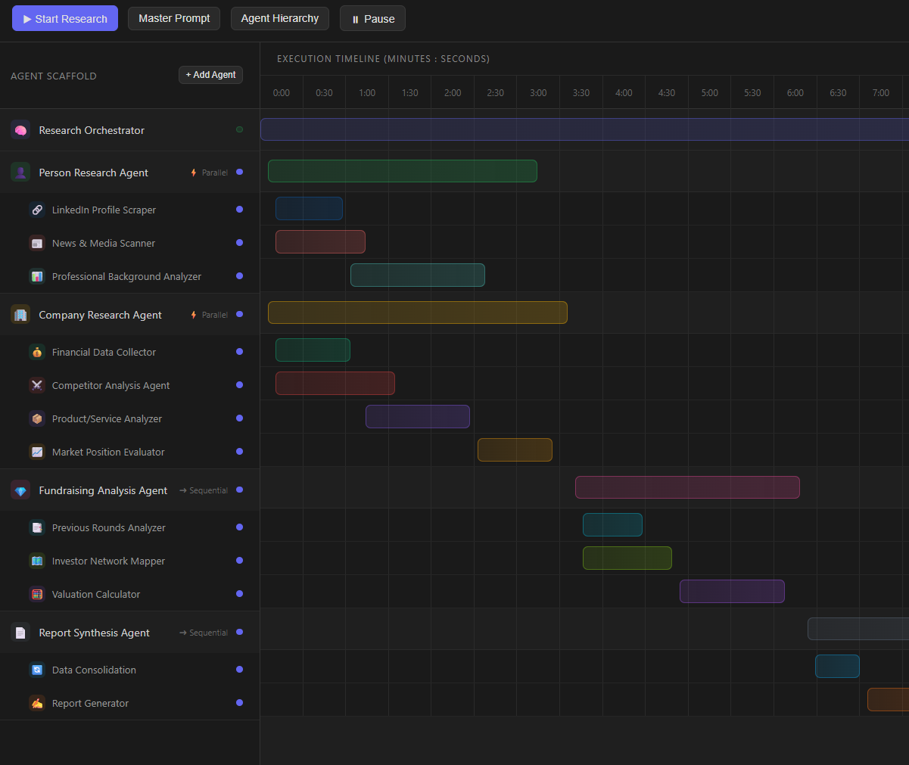
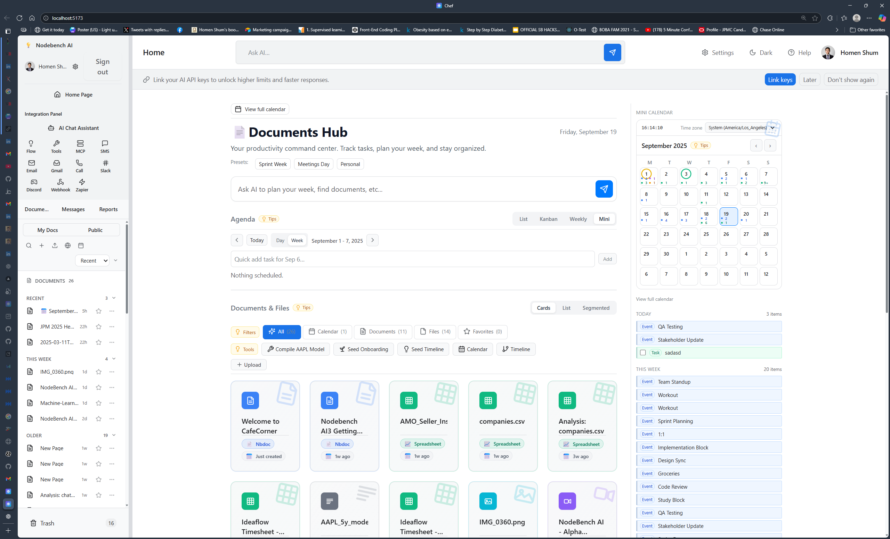
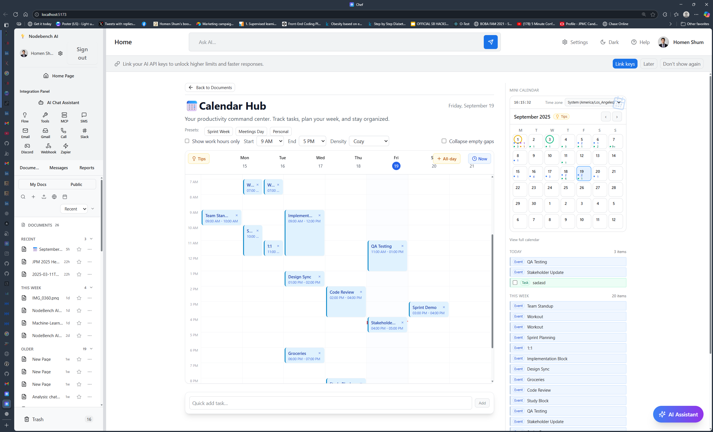
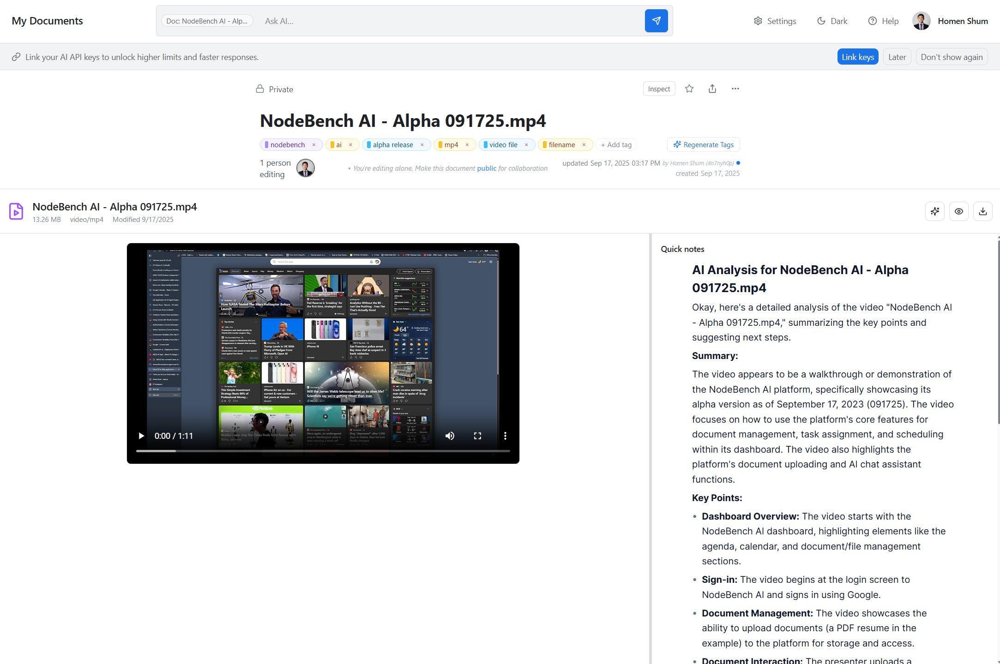
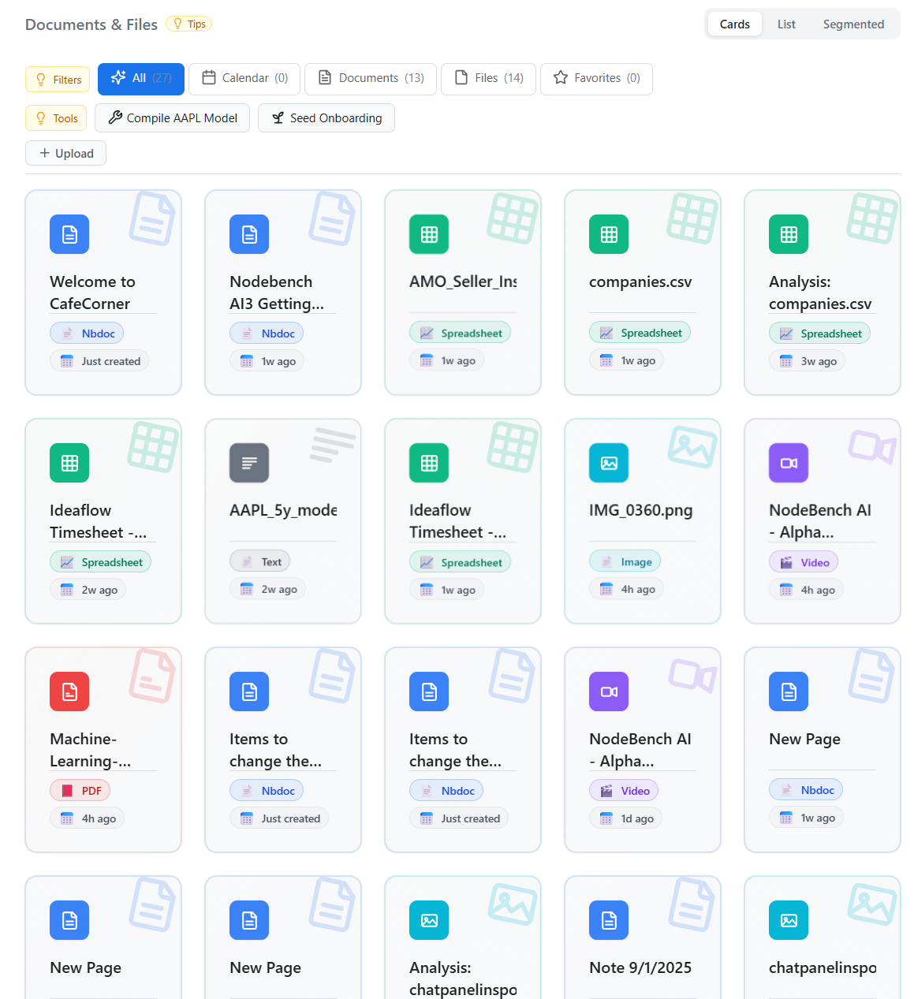
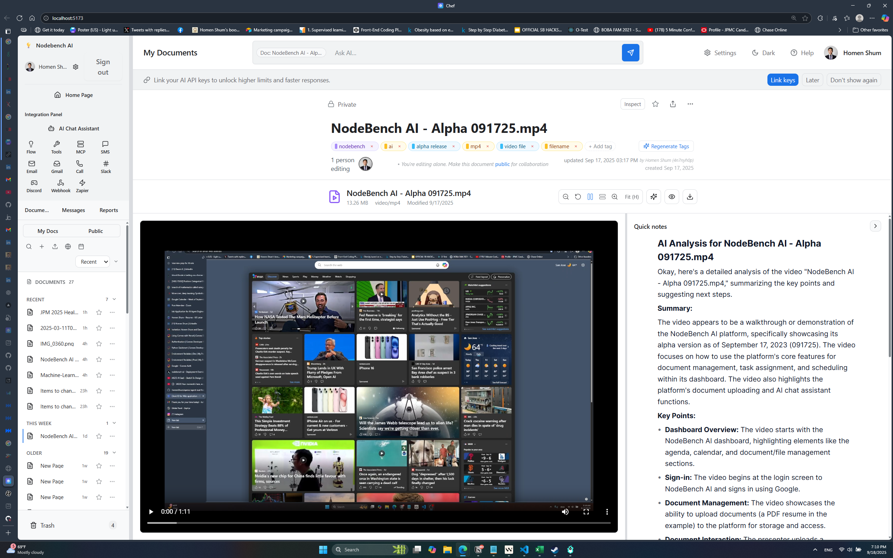
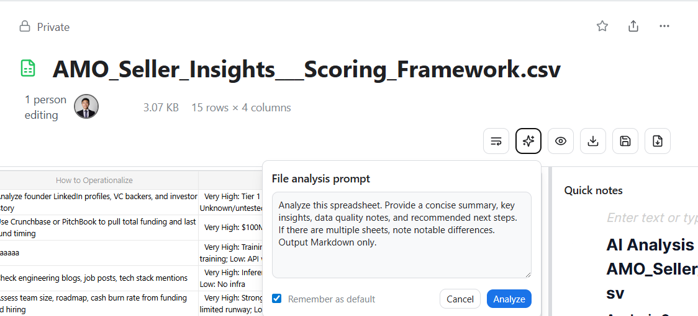
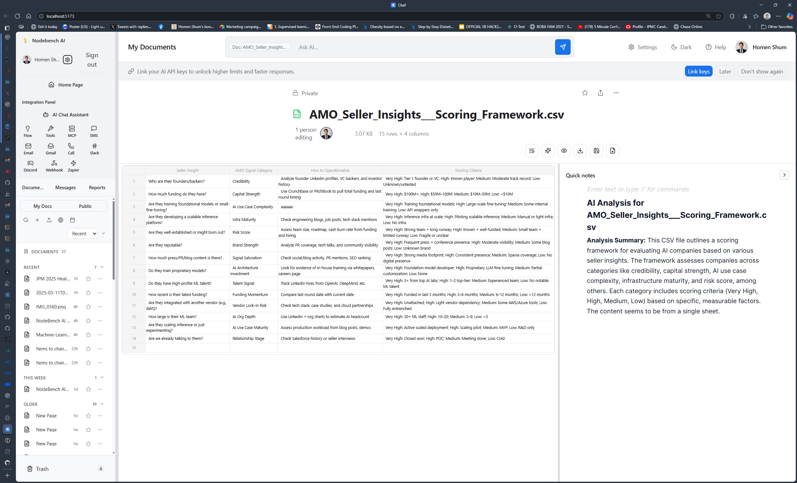
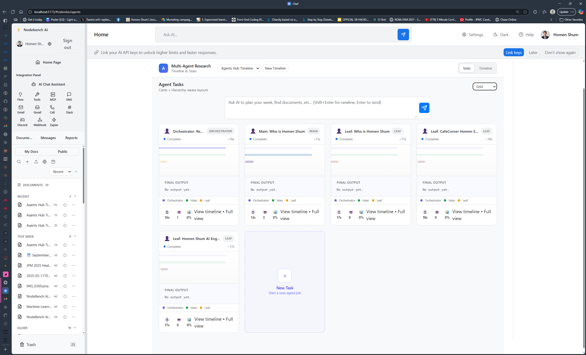
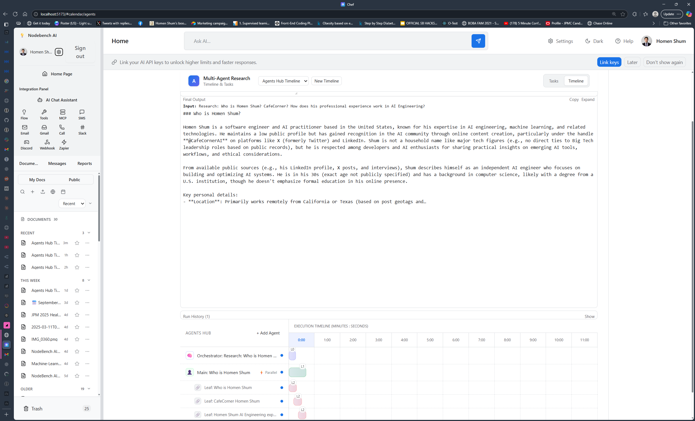

# Collaborative Text Editor with Notion-like Features

[](https://www.youtube.com/watch?v=XRYUUDNh4GQ)

This is a project built with [Chef](https://chef.convex.dev) using [Convex](https://convex.dev) as its backend.

This project is connected to the Convex deployment named [`formal-shepherd-851`](https://dashboard.convex.dev/d/formal-shepherd-851).

## Project structure

The frontend code is in the `src` directory and is built with [Vite](https://vitejs.dev/) and React.

The backend code is in the `convex` directory.

`npm run dev` will start the frontend and backend servers.

## App authentication

Chef apps use [Convex Auth](https://auth.convex.dev/) with Anonymous auth for easy sign in. You may wish to change this before deploying your app.

## Developing and deploying your app

Check out the [Convex docs](https://docs.convex.dev/) for more information on how to develop with Convex.
* If you're new to Convex, the [Overview](https://docs.convex.dev/understanding/) is a good place to start
* Check out the [Hosting and Deployment](https://docs.convex.dev/production/) docs for how to deploy your app
* Read the [Best Practices](https://docs.convex.dev/understanding/best-practices/) guide for tips on how to improve you app further

## HTTP API

User-defined http routes are defined in the `convex/router.ts` file. We split these routes into a separate file from `convex/http.ts` to allow us to prevent the LLM from modifying the authentication routes.


## Changelog (preview)

## OpenRouter Integration (Grok 4 fast)

- The project supports using OpenRouter (including x-ai/grok-4-fast:free) in both the standalone agents and Convex RAG action.
- Environment variables:
  - OPENROUTER_API_KEY=sk-or-...
  - Optional: OPENAI_BASE_URL=https://openrouter.ai/api/v1 (assumed when OPENROUTER_API_KEY is set)
  - Optional: OPENAI_MODEL=x-ai/grok-4-fast:free
- Default site URL for ranking attribution:
  - When OPENROUTER_API_KEY is set, HTTP-Referer defaults to https://nodebench-ai.vercel.app/ (override via OPENROUTER_SITE_URL). Title can be set via OPENROUTER_SITE_NAME.

See agents/README.md for CLI usage and DESIGN_SPECS.md for deeper details.

## Linkup API Integration

- We integrate Linkup via a small service wrapper at agents/services/linkup.ts.
- Environment variables:
  - LINKUP_API_KEY=sk-linkup-... (or NEXT_PUBLIC_LINKUP_API_KEY)
- Example smoke test:

```bash
node tests/linkupSmoke.mjs
```

- Available helpers (used by tools/orchestrations):
  - linkupSourcedAnswer(query): returns an answer plus sources
  - linkupPersonProfile(fullNameAndCompany): structured person brief using a JSON Schema
  - linkupCompanyProfile(companyName): structured company brief using a JSON Schema


- 2025-09-19 — UI refactor (Home Hubs), streamlined layout/navigation, improved MiniEditorPopover, Convex file/document API updates, cleanup of legacy views, and new screenshots. See full details in the [CHANGELOG](./CHANGELOG.md).

- 2025-09-18 — Chat input now supports multi-line entry and preserves list/nested list structure on paste; Convex agent fixes: remove write conflicts on appendRunEvent, await streaming event writes, fix propose_pm_ops schema (array items), and require kind in streamed plan steps. No new dependencies added.
- 2025-09-17 — Analyze with Gemini → Quick notes; header tags (AI-generated, colored by kind, inline rename, ghost add pill); new backend tag mutations. See full details and screenshots in the [CHANGELOG](./CHANGELOG.md).

Optional thumbnail preview:

#### Preview (091925) — AI Agent Timeline View




#### Preview (091925) — Mini calendar → Full Calendar Hub (parity)


### Orchestrator: Step‑by‑step walkthrough (UI)

1) Open Agents → Tasks tab and enter a multi‑line prompt in the centered bar; press Enter to run (Shift+Enter for newline).
2) You will be navigated to the Timeline tab to observe execution:
   - The orchestrator bar spans the full workflow; the red current-time-line freezes when the run completes.
   - Open the Final Output panel: Copy result or collapse/expand (preference is persisted).
   - Expand Run History to see past runs with badges for tokens, elapsed seconds, model, and retries.
3) Re-run or refine: Submit another prompt to generate a new plan and compare in history.

Tip: Planner model can be selected in Timeline (Grok via OpenRouter or OpenAI); preference persists to localStorage.








### More previews (091825)










#### Preview (092325) — Agent Dashboard updates

- Tasks view: centered multiline prompt (parity with Timeline)



- Final Output: Copy button and collapse/expand with persisted preference

.png)

- Run history: Metrics badges (tokens, elapsed, model, retries)

.png)

- Timeline: "current-time-line" freezes when workflow completes


