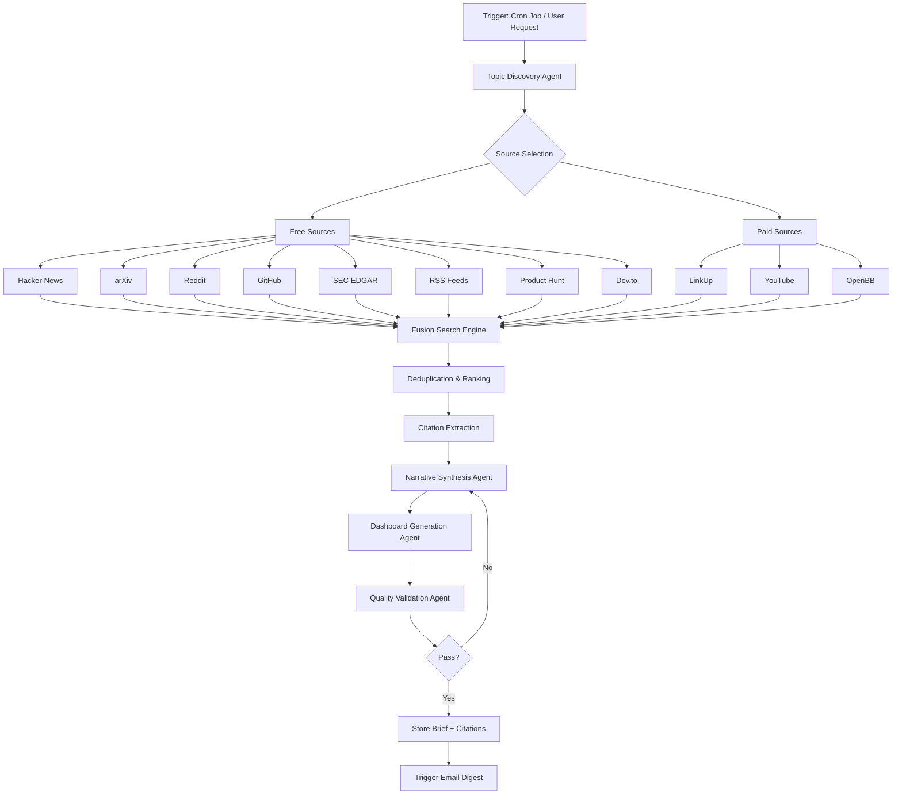

# Implementing AI-2027-Like Visual Multi-Source Research Analysis

> **Production Technical Specification for NodeBench Daily Morning Brief**
> 
> Combining the industry-focused content depth of [FierceBiotech](https://www.fiercebiotech.com/) with the narrative scrollytelling polish of [AI-2027.com](https://ai-2027.com/)

---

## Table of Contents

1. [Executive Summary](#executive-summary)
2. [Target Audience & Requirements](#target-audience--requirements)
3. [Gap Analysis: NodeBench vs AI-2027.com](#gap-analysis-nodebench-vs-ai-2027com)
4. [Data Source Architecture](#data-source-architecture)
5. [Technical Implementation Analysis](#technical-implementation-analysis)
6. [UX Patterns & Interaction Design](#ux-patterns--interaction-design)
7. [Agent-Driven Research Generation Strategy](#agent-driven-research-generation-strategy)
8. [Phased Implementation Plan](#phased-implementation-plan)
9. [Appendix: Code Patterns & Component Designs](#appendix-code-patterns--component-designs)

---

## Executive Summary

This document provides a comprehensive technical specification for enhancing NodeBench's daily morning brief feature to match and exceed the capabilities demonstrated by AI-2027.com, while serving professional audiences in venture capital, investment banking, technology leadership, and specialized industries.

### Design Inspiration: Hybrid Approach

| Aspect | FierceBiotech Inspiration | AI-2027.com Inspiration |
|--------|---------------------------|-------------------------|
| **Content Density** | High - Multiple articles, funding tables, regulatory updates per page | Moderate - Deep narrative with supporting data |
| **Update Frequency** | Real-time news feed | Static research document |
| **Consumption Style** | Scannable headlines, sortable tables | Narrative journey with scroll-triggered reveals |
| **Data Presentation** | Dense tabular data, category filtering | Interactive charts, entity linking |
| **Target Use** | Quick daily scan, reference lookup | Deep research, scenario planning |

**Our Goal:** Create daily briefs that are both **information-dense** (like FierceBiotech) AND **narratively compelling** (like AI-2027.com).

---

## Target Audience & Requirements

### Persona 1: Venture Capitalists

| Dimension | Requirement |
|-----------|-------------|
| **Information Density** | High - Need comprehensive deal flow, market trends, competitive landscape in one view |
| **Update Frequency** | Daily digest + real-time alerts for major funding announcements |
| **Preferred Format** | Executive summary bullets → Expandable deep dives → Raw data tables |
| **Decision Triggers** | New funding rounds in target sectors, emerging technology trends, founder movements |
| **Key Data Sources** | Crunchbase, PitchBook, SEC S-1/8-K filings, arXiv (for deep tech), LinkedIn (founder tracking) |

### Persona 2: JPM Startup Banking (Healthcare/Life Sciences/Technology/Disruptive Commerce)

| Dimension | Requirement |
|-----------|-------------|
| **Information Density** | Very High - Sector-specific financial metrics, valuation comps, M&A activity |
| **Update Frequency** | Daily + weekly sector deep-dives |
| **Preferred Format** | Structured reports with financial tables, trend charts, regulatory timeline |
| **Decision Triggers** | FDA approvals/rejections, clinical trial results, major acquisitions, IPO filings |
| **Key Data Sources** | SEC 10-K/10-Q/8-K, FDA databases, ClinicalTrials.gov, industry trade publications |

### Persona 3: Mercury Bankers

| Dimension | Requirement |
|-----------|-------------|
| **Information Density** | Moderate-High - Startup ecosystem health indicators, growth metrics |
| **Update Frequency** | Weekly with daily signal alerts |
| **Preferred Format** | Dashboard-style metrics with narrative context |
| **Decision Triggers** | Funding velocity changes, sector rotation signals, risk indicators |
| **Key Data Sources** | Aggregate funding data, YC batch analysis, public market correlations |

### Persona 4: Investment Bankers & Deal Makers

| Dimension | Requirement |
|-----------|-------------|
| **Information Density** | Very High - Transaction comps, valuation multiples, buyer/seller databases |
| **Update Frequency** | Real-time for active deals, daily for market intelligence |
| **Preferred Format** | Comparable transaction tables, market timing analysis, relationship mapping |
| **Decision Triggers** | Competitive deal announcements, market window changes, regulatory approvals |
| **Key Data Sources** | SEC filings, press releases, court documents (for restructuring), LinkedIn (relationship mapping) |

### Persona 5: Technology Leaders (Meta IC6-IC9 Equivalents)

| Dimension | Requirement |
|-----------|-------------|
| **Information Density** | High - Technical depth with strategic context |
| **Update Frequency** | Weekly digest with daily paper alerts |
| **Preferred Format** | Technical summaries → Paper links → Code examples |
| **Decision Triggers** | New model releases, benchmark breakthroughs, talent movements, open-source project momentum |
| **Key Data Sources** | arXiv, GitHub trending, HuggingFace, industry blogs, conference papers |

### Persona 6: Startup Founders

| Dimension | Requirement |
|-----------|-------------|
| **Information Density** | Moderate - Focused on actionable intelligence |
| **Update Frequency** | Daily brief + topic-specific alerts |
| **Preferred Format** | What changed → Why it matters → What to do next |
| **Decision Triggers** | Competitor funding/launches, market timing signals, hiring opportunities |
| **Key Data Sources** | Competitor monitoring, market research, hiring signals, product launches |

### Persona 7: Developers

| Dimension | Requirement |
|-----------|-------------|
| **Information Density** | Moderate-High - Technical details with code examples |
| **Update Frequency** | Daily for trending, weekly for deep dives |
| **Preferred Format** | TL;DR → Technical explanation → Code samples → Links |
| **Decision Triggers** | New frameworks/tools, deprecation announcements, security vulnerabilities |
| **Key Data Sources** | GitHub, Dev.to, Hacker News, Stack Overflow trends, package registries |

### Persona 8: Biotech Professionals

| Dimension | Requirement |
|-----------|-------------|
| **Information Density** | Very High - Clinical data, regulatory updates, research breakthroughs |
| **Update Frequency** | Daily with real-time trial/FDA alerts |
| **Preferred Format** | Pipeline tables, trial results summaries, regulatory calendars |
| **Decision Triggers** | Phase transitions, FDA decisions, patent expirations, competitive data |
| **Key Data Sources** | ClinicalTrials.gov, FDA, bioRxiv/medRxiv, FierceBiotech, Endpoints News |

### Persona 9: Fintech Professionals

| Dimension | Requirement |
|-----------|-------------|
| **Information Density** | High - Regulatory focus with market metrics |
| **Update Frequency** | Daily + real-time regulatory alerts |
| **Preferred Format** | Regulatory updates → Market impact → Competitive response |
| **Decision Triggers** | CFPB/OCC/Fed actions, competitor launches, partnership announcements |
| **Key Data Sources** | Federal Register, regulatory filings, fintech news, banking APIs |

### Persona 10: PitchBook/Industry Report Workers

| Dimension | Requirement |
|-----------|-------------|
| **Information Density** | Maximum - Raw data with full provenance |
| **Update Frequency** | Continuous data collection, periodic synthesis |
| **Preferred Format** | Structured data exports, citation-ready summaries |
| **Decision Triggers** | Data validation needs, trend confirmation, narrative synthesis |
| **Key Data Sources** | All available sources with full attribution chain |

---

## Gap Analysis: NodeBench vs AI-2027.com

### ✅ What NodeBench ALREADY Has (Matching AI-2027.com)

| Capability | NodeBench Implementation | AI-2027.com Equivalent |
|------------|-------------------------|------------------------|
| **Scrollytelling Engine** | `ScrollytellingLayout.tsx` with IntersectionObserver, center-band activation (`-45% 0px -45% 0px`) | Same pattern for scroll-triggered content |
| **3-Act Narrative Structure** | `DailyBriefPayload` with ActI/ActII/ActIII schema | Chronological narrative with multiple acts |
| **Sticky Dashboard** | `LiveDashboard.tsx` + `StickyDashboard.tsx` with TrendLine, MarketShare, Capabilities | Sticky right-rail dashboard updates on scroll |
| **Interactive Text Spans** | `InteractiveSpanParser.tsx` with `[[label\|dataIndex:N]]` syntax | Text→Chart bidirectional focus |
| **Smart Entity Links** | `SmartLink` component with hover tooltips | Entity linking for people, orgs, concepts |
| **Deep Dive Accordions** | `DeepDiveAccordion.tsx` for expandable content | Collapsible detailed explanations |
| **Timeline Scrubber** | `TimelineScrubber.tsx` with section navigation | Timeline progress indicator |
| **Vega-Lite Charts** | `SafeVegaChart.tsx` for agent-generated visualizations | Custom SVG charts (54+ in compute forecast) |
| **Signal & Action Lists** | `SignalList.tsx` + `ActionList.tsx` components | Structured recommendations |
| **Media Galleries** | `DossierMediaGallery.tsx` with videos, images, documents | Entity cards with media |

### ✅ What NodeBench Has BEYOND AI-2027.com

| Advantage | NodeBench Feature | AI-2027.com Lacks |
|-----------|-------------------|-------------------|
| **Real-Time Data** | Convex reactive queries, live dashboard updates | Static pre-rendered content |
| **Agent Integration** | Fast Agent Panel with streaming, tool visibility | No interactive AI assistant |
| **Multi-Source Fusion Search** | 7+ search adapters (LinkUp, arXiv, SEC, YouTube, etc.) | Single narrative source |
| **Voice Control** | Voice agent with full tool access | No voice interface |
| **Document Management** | BlockNote editor, dossier system, file attachments | Read-only document |
| **Personalization** | Hashtag topics, user preferences, custom digests | One-size-fits-all |
| **Financial Data** | OpenBB integration, SEC filing analysis, funding research | Limited financial depth |

### ❌ What NodeBench LACKS (Gap to Fill)

| Gap | AI-2027.com Feature | Priority | Implementation Effort |
|-----|---------------------|----------|----------------------|
| **Citation System** | 96+ footnotes with bidirectional links, `/footnotes` page | 🔴 High | Medium |
| **Timeline Strip** | Past→Present→Future visual context strip | 🟡 Medium | Low |
| **Research Supplements** | Separate deep-dive pages (`/research/compute-forecast`) | 🟡 Medium | Medium |
| **Entity Type Styling** | Visual distinction for person/org/concept/metric | 🟢 Low | Low |
| **Audio Narration** | Full narrative as audio (Spotify, Apple Podcasts) | 🟢 Low | High |
| **Choose Your Ending** | Branching narrative paths | 🟢 Low | Medium |
| **Custom SVG Hero Chart** | Lightweight, highly-polished main trend viz | 🟡 Medium | Medium |

### 🔄 Capabilities Requiring Enhancement

| Existing Feature | Current State | Target Enhancement |
|-----------------|---------------|-------------------|
| **InteractiveSpanParser** | Supports `SmartLink` with summary/source | Add entity `type` for styling, internal dossier links |
| **ScrollytellingLayout** | Section-based scroll sync | Add footnote markers, citation previews |
| **DailyBriefPayload** | 3-Act structure with signals/actions | Add `citations: Citation[]` array, provenance tracking |
| **Feed Ingestion** | 7 free sources + cron job | Add RSS customization, industry vertical filtering |

### 📸 Live Application Observations (December 2025)

The following observations were captured by browsing the live NodeBench application:

#### Home Page (Welcome Landing)
- **System Core Metrics**: Displays real-time system health (Uptime, Latency, Throughput, Error Rate)
- **Research Hub Card**: Entry point to research features with "Explore Research" CTA
- **Strategic Workspace Card**: Entry point to document management with "Open Workspace" CTA
- **Clean, minimal design** with dark theme and glass-morphism effects

#### Research Hub
- **Executive Synthesis**: AI-generated market summary with clickable entity buttons (Market, AI, Apple) - demonstrates existing entity linking
- **Market Movers**: 5-node visualization showing trending GitHub repos (zai-org/Open-AutoGLM, HKUDS/Paper2Slides, mistralai/mistral-vibe, etc.)
- **Your Topics**: Hashtag tracking prompt (#ai, #openai) - personalization feature
- **Personal Pulse**: Personal Intelligence Overlay and Institutional Agenda sections
- **Institutional Briefing**: Scheduled for 6 AM UTC - demonstrates scheduled digest capability
- **Live Signal Stream**: 24 feed items from GitHub and Hacker News with source filters - real-time feed ingestion working
- **Institutional Deal Flow**: Funding deals (Atlas Robotics $18M, Helix BioSystems $3.2M) - demonstrates funding research tools
- **Right Sidebar Charts**: Capability vs. Reliability Index, AI Capabilities metrics (Reasoning, Uptime, Safety) - live dashboard visualizations
- **Live Intelligence Flow**: Analysis events at bottom - demonstrates agent activity visibility

#### Fast Agent Panel
- **Streaming UI**: Shows agent "Thinking" state with animated indicator
- **Structured Responses**: Agent responses include formatted sections with headers
- **Model Selection**: Claude Haiku 4.5 visible in UI
- **Context Management**: Thread-based conversation with message history
- **Tool Visibility**: Shows `[mediaExtractor]` and other tool executions in console

#### Workspace (Documents Hub)
- **Document Cards**: Show title, preview text, "Ask AI" button, metadata (DOC type, timestamp)
- **AI Ready Status**: Documents indexed for AI analysis
- **Quick Actions**: Quick edit, Pin, Delete buttons on each card
- **Filter Tabs**: All, Calendar, Documents, Favorites with counts
- **View Modes**: Cards, List, Segmented layout options
- **Upload Button**: File upload capability

#### Calendar Hub
- **Weekly View**: Full week calendar with time slots
- **Presets**: Sprint Week, Meetings Day, Personal quick-select options
- **Mini Calendar**: Sidebar with month view and event indicators
- **Time Zone Support**: Dropdown for timezone selection

#### Agents Hub
- **3 Agent Types**: Research Agent, Analyst Agent, Sourcing Agent
- **Task Counts**: Shows pending tasks per agent
- **Agent Management**: UI for configuring and monitoring agents

#### Roadmap Hub
- **Activity Heatmap**: GitHub-style contribution visualization
- **Task Status Breakdown**: Visual breakdown of task states
- **Top Tags**: Most used tags across documents
- **Event/Agent Status**: Aggregate metrics

#### Issues Observed
- **Editor Errors**: Quick edit popover shows "Failed to load editor" for some documents with `RangeError: Unknown node type: listItem/taskItem` - indicates BlockNote schema mismatch for certain document types
  - **✅ FIXED (December 2025)**: Server-side sanitization in `convex/domains/documents/prosemirror.ts` now converts TipTap node types to BlockNote equivalents:
    - `listItem` → `bulletListItem`
    - `bulletList` → flattened `bulletListItem` children wrapped in `blockContainer`
    - `orderedList` → flattened `numberedListItem` children wrapped in `blockContainer`
    - `taskItem` → `checkListItem`
    - `taskList` → flattened `checkListItem` children wrapped in `blockContainer`
  - **Migration**: Run `internalResetAllSnapshots` mutation to sanitize all existing documents and reset ProseMirror sync snapshots
- **Mini Editor Popover**: Uses portal-based positioning with close button

### 📰 FierceBiotech UX Observations (December 2025)

The following observations were captured by browsing the live FierceBiotech website to inform the hybrid design approach:

#### Homepage Layout Structure
- **Hero Article**: Large featured story with full-width image, category tag (e.g., "Biotech"), headline, summary paragraph, author byline with avatar, and timestamp
- **Secondary Grid**: 5 smaller article cards in a 2-column layout with thumbnails, headlines, and timestamps
- **"More News" Section**: Text-only list of additional headlines with timestamps for quick scanning
- **"Now Playing" Section**: Video/podcast content integration

#### Content Density Patterns
| Element | FierceBiotech Approach | NodeBench Adaptation |
|---------|------------------------|----------------------|
| **Headlines** | Short, punchy, action-oriented ("Ipsen fails to land pivotal rare disease trial") | Use similar headline style in daily briefs |
| **Summaries** | 1-2 sentence context with key data points | Include in Executive Synthesis |
| **Timestamps** | Precise (Dec 19, 2025 3:37pm) | Show in Live Signal Stream |
| **Author Attribution** | Byline with photo | Include source attribution in citations |
| **Category Tags** | Prominent, clickable (Biotech, Pharma, Medtech) | Map to hashtag topics |

#### Navigation & Discovery
- **Top Navigation**: Home, Subscribe, Hamburger menu for full nav
- **Footer Links**: Connect (Team, Advertise), Join Us (Newsletters, Resources, RSS), Our Brands, Our Events
- **Social Links**: LinkedIn, Facebook, Twitter/X prominently displayed
- **Newsletter CTA**: Prominent "Subscribe" button in header

#### Information Architecture
```
FierceBiotech Homepage Structure:
├── Header (Logo, Subscribe, Menu)
├── Hero Article (Full-width, image + text)
├── Secondary Grid (5 articles, 2 columns)
├── More News (Text list, 4+ items)
├── Now Playing (Video/Podcast)
├── Footer (Links, Social, Legal)
```

#### Key Takeaways for NodeBench Hybrid Design

| FierceBiotech Strength | How to Incorporate |
|------------------------|-------------------|
| **Scannable Headlines** | Use in Live Signal Stream and Daily Brief headers |
| **Category Filtering** | Leverage existing hashtag system for topic filtering |
| **Timestamp Precision** | Show exact times in feed items, relative times in summaries |
| **Author/Source Attribution** | Implement citation system with source logos |
| **Dense Article Grid** | Use card-based layout in Research Hub |
| **Breaking News Prominence** | Add "Breaking" badge to high-priority items |
| **Newsletter Integration** | Enhance existing email digest with FierceBiotech-style formatting |

#### Hybrid Design Formula

```
NodeBench Daily Brief =
  FierceBiotech Content Density (headlines, timestamps, categories)
  + AI-2027 Narrative Flow (scrollytelling, 3-act structure, entity linking)
  + NodeBench Agent Intelligence (real-time research, multi-source fusion)
```

---

## Data Source Architecture

### Current NodeBench Data Sources

#### 🆓 FREE Public APIs (Already Integrated)

| Source | API | Data Type | Integration File | Status |
|--------|-----|-----------|-----------------|--------|
| **Hacker News** | Firebase API | Tech news, trending | `convex/feed.ts:ingestHackerNews` | ✅ Active |
| **arXiv** | OAI-PMH API | Research papers (AI/ML/CL) | `convex/feed.ts:ingestArXiv` | ✅ Active |
| **Reddit** | JSON API | Community discussions | `convex/feed.ts:ingestReddit` | ✅ Active |
| **GitHub** | REST API | Trending repos | `convex/feed.ts:ingestGitHubTrending` | ✅ Active |
| **Product Hunt** | RSS Feed | Product launches | `convex/feed.ts:ingestProductHunt` | ✅ Active |
| **Dev.to** | JSON API | Developer articles | `convex/feed.ts:ingestDevTo` | ✅ Active |
| **TechCrunch** | RSS Feed | Tech news | `convex/feed.ts:ingestRSS` | ✅ Active |
| **SEC EDGAR** | REST API | 10-K, 10-Q, 8-K, S-1 filings | `convex/tools/sec/secFilingTools.ts` | ✅ Active |

#### 💰 PAID API Integrations (Already Integrated)

| Source | API | Data Type | Integration File | Status |
|--------|-----|-----------|-----------------|--------|
| **LinkUp** | Search API | Web search + structured outputs | `convex/tools/media/linkupSearch.ts` | ✅ Active |
| **YouTube** | Data API v3 | Video search + metadata | `convex/tools/media/youtubeSearch.ts` | ✅ Active |
| **Perplexity** | Chat API | Sourced answers | Via LinkUp adapter | ✅ Active |
| **OpenBB** | Platform API | Stock, crypto, economic data | `convex/domains/agents/core/subagents/openbb_subagent/` | ✅ Active |

#### 📋 Fusion Search Adapters

| Adapter | Source | File |
|---------|--------|------|
| `arxivAdapter` | arXiv papers | `convex/domains/search/fusion/adapters/arxivAdapter.ts` |
| `linkupAdapter` | LinkUp web search | `convex/domains/search/fusion/adapters/linkupAdapter.ts` |
| `youtubeAdapter` | YouTube videos | `convex/domains/search/fusion/adapters/youtubeAdapter.ts` |
| `secAdapter` | SEC filings | `convex/domains/search/fusion/adapters/secAdapter.ts` |
| `newsAdapter` | News aggregation | `convex/domains/search/fusion/adapters/newsAdapter.ts` |
| `documentAdapter` | Internal documents | `convex/domains/search/fusion/adapters/documentAdapter.ts` |
| `ragAdapter` | Vector search | `convex/domains/search/fusion/adapters/ragAdapter.ts` |

### Recommended Additional Sources (Not Yet Integrated)

| Source | API | Data Type | Priority | Use Case |
|--------|-----|-----------|----------|----------|
| **PubMed** | E-utilities API (FREE) | Biomedical papers | 🔴 High | Biotech persona |
| **bioRxiv/medRxiv** | API (FREE) | Preprints | 🔴 High | Biotech persona |
| **SSRN** | Search (FREE) | Business/finance papers | 🟡 Medium | Finance persona |
| **Google Scholar** | SerpAPI (PAID) | Academic papers | 🟡 Medium | Research depth |
| **ClinicalTrials.gov** | API (FREE) | Trial data | 🔴 High | Biotech persona |
| **FDA** | openFDA API (FREE) | Drug approvals | 🔴 High | Biotech persona |
| **Federal Register** | API (FREE) | Regulations | 🟡 Medium | Fintech persona |
| **Crunchbase** | API (PAID) | Funding data | 🟡 Medium | VC persona |
| **PitchBook** | API (PAID) | Deal data | 🟢 Low | IB persona |
| **LinkedIn** | Sales Navigator (PAID) | People/company data | 🟢 Low | Relationship mapping |

---

## Technical Implementation Analysis

### AI-2027.com Technical Stack (Confirmed)

| Component | Technology | Evidence |
|-----------|------------|----------|
| **Framework** | Next.js App Router | `/_next/static/chunks/main-app-*.js` script pattern |
| **Deployment** | Vercel | `/_vercel/insights/script.js`, `/_vercel/speed-insights/script.js` |
| **Charts** | Custom SVG | 54+ inline SVG elements in `/research/compute-forecast` |
| **Scroll Handling** | IntersectionObserver | Standard pattern for scroll-triggered content |
| **Styling** | Tailwind CSS | Class patterns consistent with Tailwind |
| **Footnotes** | Custom React | Dedicated `/footnotes` page with bidirectional links |

### NodeBench Technical Stack (Current)

| Component | Technology | File Location |
|-----------|------------|---------------|
| **Framework** | Next.js App Router | Standard Next.js structure |
| **Backend** | Convex | `convex/` directory |
| **Editor** | BlockNote + ProseMirror | `src/features/editor/components/UnifiedEditor.tsx` |
| **Charts** | Vega-Lite + Recharts | `SafeVegaChart.tsx`, `EnhancedLineChart` |
| **Scroll** | IntersectionObserver | `ScrollytellingLayout.tsx` |
| **Agent** | @convex-dev/agent | `convex/domains/agents/` |

### Key Technical Patterns to Adopt

#### 1. Citation/Footnote System

```typescript
// Proposed: convex/domains/research/types/citationSchema.ts
interface Citation {
  id: string;                    // "footnote-1"
  index: number;                 // Display index (1, 2, 3...)
  text: string;                  // Full citation text
  sourceUrl?: string;            // External link
  sourceType: "paper" | "report" | "news" | "filing" | "internal";
  retrievedAt: number;           // Timestamp
  confidence?: number;           // 0-1 for AI-generated citations
  sectionRef: string;            // Which section references this
}

interface CitationIndex {
  bySection: Record<string, string[]>;  // sectionId → citationIds
  byDocument: {
    mainDocument: string[];
    researchSupplements: Record<string, string[]>;
  };
}
```

#### 2. Research Supplement Structure

```typescript
// Proposed: src/features/research/types/researchSupplement.ts
interface ResearchSupplement {
  id: string;                    // "compute-forecast"
  title: string;                 // "The Compute Forecast"
  slug: string;                  // URL path
  parentBriefId: string;         // Links to main daily brief
  sections: SupplementSection[];
  charts: ChartDefinition[];
  tables: TableDefinition[];
  citations: Citation[];
}

interface SupplementSection {
  id: string;
  anchor: string;                // "#section-1-compute-production"
  title: string;
  content: string[];
  charts: string[];              // Chart IDs in this section
  citations: string[];           // Citation IDs
}
```

#### 3. Enhanced Entity Linking

```typescript
// Enhancement to: src/features/research/components/InteractiveSpanParser.tsx
interface EntityLink {
  id: string;
  label: string;
  type: "person" | "org" | "concept" | "metric" | "filing" | "paper";
  summary: string;
  source?: string;
  internalDocId?: Id<"documents">;  // Link to NodeBench dossier
  externalUrl?: string;
  metadata?: {
    // For person
    role?: string;
    organization?: string;
    // For org
    ticker?: string;
    sector?: string;
    // For filing
    formType?: string;
    filingDate?: string;
    // For paper
    arxivId?: string;
    authors?: string[];
  };
}

// Styling map for entity types
const entityStyles: Record<EntityType, string> = {
  person: "text-indigo-600 hover:text-indigo-800 underline decoration-dotted",
  org: "text-emerald-600 hover:text-emerald-800 font-medium",
  concept: "text-amber-600 hover:text-amber-800 italic",
  metric: "text-rose-600 hover:text-rose-800 font-mono",
  filing: "text-slate-600 hover:text-slate-800 underline",
  paper: "text-purple-600 hover:text-purple-800 underline",
};
```

---

## UX Patterns & Interaction Design

### AI-2027.com UX Patterns (Observed)

| Pattern | Implementation | User Benefit |
|---------|----------------|--------------|
| **Scroll-Triggered Reveals** | Sections activate as they enter center viewport | Progressive disclosure |
| **Sticky Dashboard** | Right-rail updates in sync with narrative position | Context always visible |
| **Superscript Footnotes** | `[1]` markers with hover preview, click to expand | Trust through sourcing |
| **Back-Reference Links** | `↩` from footnote back to source location | Easy navigation |
| **Section Navigation** | "BACK TO NAVIGATION" buttons, anchor links | Quick jumping |
| **Entity Popovers** | Hover on person/org names for context | Contextual information |
| **Deep Dive Expansion** | Inline accordions for detailed explanations | Optional depth |
| **Choose Your Ending** | Branching paths (`/slowdown`, `/race`) | Scenario exploration |
| **Audio Option** | Full narration available via podcast platforms | Alternative consumption |

### FierceBiotech UX Patterns (Observed)

| Pattern | Implementation | User Benefit |
|---------|----------------|--------------|
| **Category Tabs** | Biotech, Pharma, Medtech, etc. | Quick filtering |
| **Sortable Tables** | Funding rounds, pipeline data | Data exploration |
| **Breaking News Banner** | Prominent top placement | Urgency signaling |
| **Newsletter Signup** | Prominent CTA with topic selection | Personalization |
| **Sidebar Trending** | Most-read articles | Discovery |
| **Date Filtering** | Today, This Week, This Month | Temporal navigation |
| **Export Options** | PDF, Excel for data tables | Professional use |

### Recommended NodeBench UX Enhancements

#### Priority 1: Citation System UX

```
User Flow:
1. Reading narrative → Sees superscript [1]
2. Hover → Preview tooltip with source summary
3. Click → Smooth scroll to footnote section OR popover with full citation
4. From footnote → Click ↩ to return to source location
5. From footnote → Click external link to verify source
```

#### Priority 2: Timeline Strip UX

```
Layout:
┌─────────────────────────────────────────────────────────┐
│  ← PAST          PRESENT →         FUTURE →             │
│  [Q4 2024]       [NOW: Dec 21]     [Q1 2025] [Q2 2025]  │
│     ●────────────────●─────────────────○─────────○      │
│                      ▲                                  │
│               Current Position                          │
└─────────────────────────────────────────────────────────┘
```

#### Priority 3: Bidirectional Focus UX

```
Text → Chart:
1. Hover on "[[the spike in funding|dataIndex:3]]" in narrative
2. Chart automatically highlights data point 3
3. Tooltip appears on chart showing the value
4. Smooth animation draws attention

Chart → Text:
1. Hover on data point 3 in chart
2. Corresponding text span highlights in narrative
3. Scroll into view if needed
```

---

## Agent-Driven Research Generation Strategy

### Multi-Source Research Workflow



### Comprehensive Source Coverage by Use Case

#### Academic & Research Sources

| Source | API | Data Type | Agent Tool | Persona Served |
|--------|-----|-----------|------------|----------------|
| **arXiv** | OAI-PMH (FREE) | CS/ML/AI papers | `ingestArXiv` | Tech Leaders, Developers |
| **PubMed** | E-utilities (FREE) | Biomedical papers | `ingestPubMed` (new) | Biotech |
| **bioRxiv/medRxiv** | API (FREE) | Preprints | `ingestBioRxiv` (new) | Biotech |
| **SSRN** | Search (FREE) | Business/Finance papers | `ingestSSRN` (new) | Finance, IB |
| **Google Scholar** | SerpAPI (PAID) | All academic | `scholarSearch` (new) | All research |

#### Industry & Trade Publications

| Source | Method | Data Type | Agent Tool | Persona Served |
|--------|--------|-----------|------------|----------------|
| **TechCrunch** | RSS (FREE) | Tech news | `ingestRSS` | Founders, VCs |
| **Wired** | RSS (FREE) | Tech culture | `ingestRSS` | Tech Leaders |
| **Ars Technica** | RSS (FREE) | Deep tech | `ingestRSS` | Developers |
| **FierceBiotech** | RSS (NEW) | Biotech news | `ingestRSS` | Biotech |
| **Endpoints News** | RSS (NEW) | Pharma/Biotech | `ingestRSS` | Biotech |
| **Finextra** | RSS (NEW) | Fintech news | `ingestRSS` | Fintech |
| **The Information** | Manual/Scrape | Tech insider | `linkupSearch` | VCs, IB |

#### Financial & Regulatory Data

| Source | API | Data Type | Agent Tool | Persona Served |
|--------|-----|-----------|------------|----------------|
| **SEC EDGAR** | REST (FREE) | 10-K, 10-Q, 8-K, S-1 | `searchSecFilings` | All finance |
| **OpenBB** | Platform (PAID) | Stock, crypto, economic | `OpenBBAgent` | Finance |
| **Federal Register** | API (FREE) | Regulations | `ingestFedRegister` (new) | Fintech |
| **FDA openFDA** | API (FREE) | Drug approvals | `ingestFDA` (new) | Biotech |
| **ClinicalTrials.gov** | API (FREE) | Trial data | `ingestClinicalTrials` (new) | Biotech |

#### Social & Community Sources

| Source | API | Data Type | Agent Tool | Persona Served |
|--------|-----|-----------|------------|----------------|
| **Hacker News** | Firebase (FREE) | Tech discussions | `ingestHackerNews` | Developers |
| **Reddit** | JSON (FREE) | Community signals | `ingestReddit` | All |
| **Dev.to** | JSON (FREE) | Developer articles | `ingestDevTo` | Developers |
| **YouTube** | Data API (PAID) | Video content | `youtubeSearch` | All |
| **Twitter/X** | API (PAID) | Expert signals | `twitterSearch` (new) | All |
| **LinkedIn** | Sales Nav (PAID) | People/company | `linkedinSearch` (new) | IB, VCs |

#### Product & Open Source

| Source | API | Data Type | Agent Tool | Persona Served |
|--------|-----|-----------|------------|----------------|
| **GitHub** | REST (FREE) | Trending repos | `ingestGitHubTrending` | Developers |
| **Product Hunt** | RSS (FREE) | Product launches | `ingestProductHunt` | Founders |
| **HuggingFace** | API (FREE) | ML models | `ingestHuggingFace` (new) | Tech Leaders |
| **npm/PyPI** | API (FREE) | Package trends | `ingestPackageRegistries` (new) | Developers |

### Citation Validation Pipeline

```typescript
// convex/domains/research/workflows/citationValidation.ts
const citationValidationWorkflow = workflowManager.define({
  name: "validateCitations",
  steps: [
    // Step 1: Extract claims from narrative
    step.runAction("extractClaims", {
      input: "narrative text",
      output: "Array<{ claim: string, suggestedSource: string }>"
    }),

    // Step 2: Fetch source content for each claim
    step.runAction("fetchSources", {
      parallel: true,
      maxConcurrency: 10,
    }),

    // Step 3: Validate claim against source
    step.runAction("validateClaimAgainstSource", {
      useLLMJudge: true,
      threshold: 0.8,  // 80% confidence required
    }),

    // Step 4: Generate citation text
    step.runAction("formatCitation", {
      style: "footnote",  // or "inline", "endnote"
      includeRetrievalDate: true,
    }),

    // Step 5: Store validated citations
    step.runMutation("storeCitations", {
      linkToNarrative: true,
      createBackReferences: true,
    }),
  ],
});
```

### Narrative Synthesis with 3-Act Structure

```typescript
// convex/domains/research/briefGenerator.ts - Enhanced
interface BriefGenerationContext {
  briefDate: string;
  feedItems: FeedItem[];
  userPreferences?: {
    topics: string[];
    industries: string[];
    fundingStages?: string[];
  };
  previousBriefs?: DailyBriefPayload[];  // For continuity
}

interface EnhancedDailyBriefPayload extends DailyBriefPayload {
  citations: Citation[];
  researchSupplements?: ResearchSupplement[];
  entityIndex: EntityIndex;
  timelineContext: {
    past: TimelineEvent[];      // What happened before today
    present: TimelineEvent[];   // What happened today
    future: TimelineEvent[];    // What's expected
  };
}

const ENHANCED_BRIEF_PROMPT = `
You are an expert financial analyst creating a daily intelligence brief.

STRUCTURE:
Act I - CONTEXT (What happened)
- Yesterday's key events
- Background for today's developments
- Set up the "why this matters"

Act II - SIGNALS (What's changing)
- Today's major news and announcements
- Funding rounds and M&A activity
- Regulatory updates
- Technical breakthroughs
- Each signal must cite sources using [n] notation

Act III - ACTIONS (What to do)
- Recommended next steps
- Watchlist items
- Questions to investigate
- Timeline of upcoming events

CITATION RULES:
- Every factual claim MUST have a citation [n]
- Use provided sources only
- If uncertain, mark as "unverified" and skip citation
- Format: "[1] Source Name, Date, URL"

ENTITY LINKING:
- Mark people as <entity type="person">Name</entity>
- Mark organizations as <entity type="org">Company</entity>
- Mark concepts as <entity type="concept">Term</entity>
- Mark metrics as <entity type="metric">$10M</entity>

WRITING STYLE:
- Be deictic: "the spike in funding" → references chart
- Use [[label|dataIndex:N]] for chart references
- Professional but accessible
- Quantitative where possible
`;
```

---

## Phased Implementation Plan

### Phase 1: Citation & Provenance System (Week 1-2)

**Objective:** Add AI-2027.com-like footnote citations with bidirectional linking

| Task | Files to Create/Modify | Priority |
|------|------------------------|----------|
| **Citation Schema** | `convex/domains/research/types/citationSchema.ts` (new) | 🔴 P0 |
| **Footnote Marker Component** | `src/features/research/components/FootnoteMarker.tsx` (new) | 🔴 P0 |
| **Citation Storage** | `convex/domains/research/citationMutations.ts` (new) | 🔴 P0 |
| **Footnotes Page** | `src/features/research/views/FootnotesPage.tsx` (new) | 🟡 P1 |
| **Citation Parser in Text** | `InteractiveSpanParser.tsx` (enhance) | 🟡 P1 |
| **Back-Reference Links** | `ScrollytellingLayout.tsx` (enhance) | 🟡 P1 |

**Deliverables:**
- [ ] Footnote markers appear in narrative text as `[1]`, `[2]`, etc.
- [ ] Hover on footnote shows preview tooltip
- [ ] Click on footnote scrolls to footnotes section or opens popover
- [ ] Footnotes page shows all citations grouped by section
- [ ] Back-links (`↩`) navigate from footnote to source location

### Phase 2: Timeline Strip & Temporal Context (Week 3)

**Objective:** Add Past→Present→Future timeline visualization

| Task | Files to Create/Modify | Priority |
|------|------------------------|----------|
| **Timeline Strip Component** | `src/features/research/components/TimelineStrip.tsx` (new) | 🔴 P0 |
| **Timeline Data Schema** | `src/features/research/types/dailyBriefSchema.ts` (enhance) | 🔴 P0 |
| **Timeline Strip Integration** | `ScrollytellingLayout.tsx` (enhance) | 🟡 P1 |
| **Timeline Event Cards** | `src/features/research/components/TimelineEventCard.tsx` (new) | 🟡 P1 |

**Deliverables:**
- [ ] Sticky timeline strip at top of scrollytelling view
- [ ] Past/Present/Future sections clearly delineated
- [ ] Clickable events navigate to relevant sections
- [ ] Visual progress indicator shows current position

### Phase 3: Enhanced Entity Linking (Week 4)

**Objective:** Add typed entity links with visual distinction and internal dossier connections

| Task | Files to Create/Modify | Priority |
|------|------------------------|----------|
| **Entity Type System** | `src/features/research/types/entityTypes.ts` (new) | 🔴 P0 |
| **Enhanced SmartLink** | `InteractiveSpanParser.tsx` (enhance) | 🔴 P0 |
| **Entity Popover** | `src/features/research/components/EntityPopover.tsx` (new) | 🟡 P1 |
| **Dossier Auto-Creation** | `convex/tools/document/hashtagSearchTools.ts` (enhance) | 🟡 P1 |

**Deliverables:**
- [ ] Entities styled by type (person, org, concept, metric, filing, paper)
- [ ] Hover shows context-rich popover
- [ ] Click on entity with internal dossier navigates to dossier
- [ ] Click on entity without dossier offers to create one

### Phase 4: Multi-Source Research Agent (Week 5-6)

**Objective:** Implement comprehensive multi-source research workflow with citation validation

| Task | Files to Create/Modify | Priority |
|------|------------------------|----------|
| **New Source Adapters** | `convex/domains/search/fusion/adapters/` (new files) | 🔴 P0 |
| **Citation Validation Workflow** | `convex/domains/research/workflows/citationValidation.ts` (new) | 🔴 P0 |
| **Enhanced Brief Generator** | `convex/domains/research/briefGenerator.ts` (enhance) | 🟡 P1 |
| **Source Quality Ranking** | `convex/tools/arbitrage/sourceQualityRanking.ts` (enhance) | 🟡 P1 |

**New Source Adapters to Implement:**

```typescript
// Priority order based on persona coverage
const newAdapters = [
  // Week 5
  { name: "pubmedAdapter", priority: "P0", personas: ["Biotech"] },
  { name: "biorxivAdapter", priority: "P0", personas: ["Biotech"] },
  { name: "fdaAdapter", priority: "P0", personas: ["Biotech"] },
  { name: "clinicalTrialsAdapter", priority: "P0", personas: ["Biotech"] },

  // Week 6
  { name: "federalRegisterAdapter", priority: "P1", personas: ["Fintech"] },
  { name: "huggingfaceAdapter", priority: "P1", personas: ["Tech Leaders"] },
  { name: "ssrnAdapter", priority: "P2", personas: ["Finance", "IB"] },
];
```

**Deliverables:**
- [ ] 4+ new free source adapters integrated
- [ ] Citation validation with 80%+ confidence threshold
- [ ] Source quality ranking with trustworthiness scores
- [ ] Fallback chain for failed sources

### Phase 5: Research Supplements (Week 7-8)

**Objective:** Add deep-dive research supplement pages linked to daily briefs

| Task | Files to Create/Modify | Priority |
|------|------------------------|----------|
| **Supplement Schema** | `src/features/research/types/researchSupplement.ts` (new) | 🔴 P0 |
| **Supplement Page** | `src/features/research/views/ResearchSupplementPage.tsx` (new) | 🔴 P0 |
| **Supplement Navigation** | `ScrollytellingLayout.tsx` (enhance) | 🟡 P1 |
| **Supplement Generation Agent** | `convex/domains/research/supplementGenerator.ts` (new) | 🟡 P1 |

**Deliverables:**
- [ ] Supplement pages for deep-dive topics (e.g., `/research/funding-forecast`)
- [ ] Cross-linking between main brief and supplements
- [ ] Supplement-specific charts and data tables
- [ ] Auto-generation of supplements from tagged topics

### Phase 6: Email Digest & Personalization (Week 9-10)

**Objective:** Implement personalized daily email digests

| Task | Files to Create/Modify | Priority |
|------|------------------------|----------|
| **Email Template** | `convex/domains/email/templates/dailyBriefEmail.tsx` (new) | 🔴 P0 |
| **Digest Workflow** | `convex/domains/email/workflows/digestWorkflow.ts` (new) | 🔴 P0 |
| **User Preferences** | `convex/domains/users/preferences.ts` (enhance) | 🟡 P1 |
| **Digest History View** | `src/features/research/views/DigestHistoryPage.tsx` (new) | 🟡 P1 |

**Deliverables:**
- [ ] Daily email digests with DossierViewer-style HTML
- [ ] Personalization based on hashtag topic subscriptions
- [ ] Manual trigger to send digest on demand
- [ ] Digest history view in app

---

## Appendix: Code Patterns & Component Designs

### A.1 Timeline Strip Component

```tsx
// src/features/research/components/TimelineStrip.tsx
import React from "react";
import { cn } from "@/lib/utils";

interface TimelineEvent {
  date: string;
  label: string;
  type: "past" | "present" | "future";
  sectionId?: string;
}

interface TimelineStripProps {
  events: TimelineEvent[];
  activeIndex: number;
  onEventClick?: (index: number) => void;
}

export const TimelineStrip: React.FC<TimelineStripProps> = ({
  events,
  activeIndex,
  onEventClick,
}) => {
  return (
    <div className="sticky top-0 z-20 bg-white/95 backdrop-blur-sm border-b border-gray-200 py-3 px-4">
      <div className="flex items-center justify-between max-w-4xl mx-auto">
        {/* Past Label */}
        <span className="text-[10px] uppercase tracking-widest text-gray-400 font-medium">
          ← Past
        </span>

        {/* Timeline Events */}
        <div className="flex-1 flex items-center justify-center gap-1 px-4">
          {events.map((event, idx) => (
            <button
              key={`${event.date}-${idx}`}
              onClick={() => onEventClick?.(idx)}
              className={cn(
                "flex flex-col items-center gap-0.5 px-2 py-1 rounded transition-all",
                "hover:bg-gray-100",
                idx === activeIndex && "bg-gray-900 text-white hover:bg-gray-800",
                idx < activeIndex && "text-gray-500",
                idx > activeIndex && "text-gray-300"
              )}
            >
              <span className="text-[8px] uppercase tracking-wider opacity-75">
                {event.type}
              </span>
              <span className="text-[11px] font-medium whitespace-nowrap">
                {event.label}
              </span>
            </button>
          ))}
        </div>

        {/* Future Label */}
        <span className="text-[10px] uppercase tracking-widest text-gray-400 font-medium">
          Future →
        </span>
      </div>

      {/* Progress Bar */}
      <div className="absolute bottom-0 left-0 right-0 h-0.5 bg-gray-100">
        <div
          className="h-full bg-gray-900 transition-all duration-300"
          style={{ width: `${((activeIndex + 1) / events.length) * 100}%` }}
        />
      </div>
    </div>
  );
};
```

### A.2 Footnote Marker Component

```tsx
// src/features/research/components/FootnoteMarker.tsx
import React, { useState } from "react";
import { cn } from "@/lib/utils";

interface FootnoteMarkerProps {
  id: string;
  index: number;
  preview?: string;
  sourceUrl?: string;
  onNavigateToFootnote?: (id: string) => void;
}

export const FootnoteMarker: React.FC<FootnoteMarkerProps> = ({
  id,
  index,
  preview,
  sourceUrl,
  onNavigateToFootnote,
}) => {
  const [showPreview, setShowPreview] = useState(false);

  return (
    <span className="relative inline">
      <sup
        id={`footnote-ref-${id}`}
        className={cn(
          "text-indigo-600 hover:text-indigo-800 cursor-pointer font-medium",
          "text-[10px] align-super ml-0.5"
        )}
        onMouseEnter={() => setShowPreview(true)}
        onMouseLeave={() => setShowPreview(false)}
        onClick={() => onNavigateToFootnote?.(id)}
      >
        [{index}]
      </sup>

      {/* Preview Tooltip */}
      {showPreview && preview && (
        <div
          className={cn(
            "absolute bottom-full left-1/2 -translate-x-1/2 mb-2",
            "w-72 p-3 bg-white rounded-lg shadow-lg border border-gray-200",
            "text-sm z-50 animate-in fade-in duration-150"
          )}
        >
          <p className="text-gray-700 text-xs leading-relaxed line-clamp-3">
            {preview}
          </p>
          {sourceUrl && (
            <a
              href={sourceUrl}
              target="_blank"
              rel="noopener noreferrer"
              className="text-indigo-600 text-[10px] mt-2 block hover:underline"
              onClick={(e) => e.stopPropagation()}
            >
              View source →
            </a>
          )}
        </div>
      )}
    </span>
  );
};
```

### A.3 Entity Popover Component

```tsx
// src/features/research/components/EntityPopover.tsx
import React from "react";
import { cn } from "@/lib/utils";
import { Building2, User, BookOpen, TrendingUp, FileText, GraduationCap } from "lucide-react";

type EntityType = "person" | "org" | "concept" | "metric" | "filing" | "paper";

interface EntityPopoverProps {
  type: EntityType;
  label: string;
  summary: string;
  source?: string;
  internalDocId?: string;
  externalUrl?: string;
  metadata?: Record<string, string>;
  onNavigateToDossier?: (docId: string) => void;
}

const entityConfig: Record<EntityType, { icon: React.ComponentType<any>; color: string }> = {
  person: { icon: User, color: "text-indigo-600 bg-indigo-50" },
  org: { icon: Building2, color: "text-emerald-600 bg-emerald-50" },
  concept: { icon: BookOpen, color: "text-amber-600 bg-amber-50" },
  metric: { icon: TrendingUp, color: "text-rose-600 bg-rose-50" },
  filing: { icon: FileText, color: "text-slate-600 bg-slate-50" },
  paper: { icon: GraduationCap, color: "text-purple-600 bg-purple-50" },
};

export const EntityPopover: React.FC<EntityPopoverProps> = ({
  type,
  label,
  summary,
  source,
  internalDocId,
  externalUrl,
  metadata,
  onNavigateToDossier,
}) => {
  const config = entityConfig[type];
  const Icon = config.icon;

  return (
    <div className="w-80 p-4 bg-white rounded-lg shadow-xl border border-gray-200">
      {/* Header */}
      <div className="flex items-start gap-3 mb-3">
        <div className={cn("p-2 rounded-lg", config.color)}>
          <Icon className="w-4 h-4" />
        </div>
        <div className="flex-1 min-w-0">
          <h4 className="font-semibold text-gray-900 truncate">{label}</h4>
          <span className="text-[10px] uppercase tracking-wider text-gray-400">
            {type}
          </span>
        </div>
      </div>

      {/* Summary */}
      <p className="text-sm text-gray-600 leading-relaxed mb-3">{summary}</p>

      {/* Metadata */}
      {metadata && Object.keys(metadata).length > 0 && (
        <div className="flex flex-wrap gap-2 mb-3">
          {Object.entries(metadata).map(([key, value]) => (
            <span
              key={key}
              className="text-[10px] px-2 py-0.5 bg-gray-100 rounded-full text-gray-600"
            >
              {key}: {value}
            </span>
          ))}
        </div>
      )}

      {/* Actions */}
      <div className="flex gap-2 pt-2 border-t border-gray-100">
        {internalDocId && (
          <button
            onClick={() => onNavigateToDossier?.(internalDocId)}
            className="flex-1 text-xs py-1.5 px-3 bg-gray-900 text-white rounded hover:bg-gray-800 transition"
          >
            View Dossier
          </button>
        )}
        {externalUrl && (
          <a
            href={externalUrl}
            target="_blank"
            rel="noopener noreferrer"
            className="flex-1 text-xs py-1.5 px-3 border border-gray-200 rounded hover:bg-gray-50 transition text-center"
          >
            View Source
          </a>
        )}
      </div>

      {/* Source Attribution */}
      {source && (
        <p className="text-[10px] text-gray-400 mt-2">Source: {source}</p>
      )}
    </div>
  );
};
```

---

## Summary

This technical specification provides a comprehensive roadmap for enhancing NodeBench's daily morning brief feature to match the narrative excellence of AI-2027.com while maintaining the information density required by professional audiences in venture capital, investment banking, technology leadership, and specialized industries.

**Key Advantages of NodeBench's Approach:**
1. **Real-time data** from Convex (vs. static content)
2. **Multi-source fusion** from 15+ free and paid APIs
3. **AI-assisted research** with citation validation
4. **Personalization** through hashtag subscriptions
5. **Interactive exploration** via Fast Agent Panel

**Implementation Priority:**
1. Citation System (P0) - Trust through sourcing
2. Timeline Strip (P0) - Temporal context
3. Entity Linking (P1) - Knowledge connections
4. Multi-Source Research (P1) - Content depth
5. Research Supplements (P2) - Deep dives
6. Email Digests (P2) - Distribution

**Total Estimated Effort:** 10 weeks for full implementation

---

*Document Version: 1.0*
*Last Updated: December 21, 2025*
*Author: NodeBench AI Assistant*


