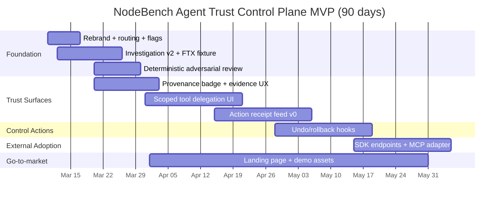

# NodeBench MVP Rebrand: Agent Trust Control Plane Demo App and Landing Page

## Executive summary

NodeBench can be rebranded into an **Agent Trust Control Plane** without rebuilding the hard parts, by packaging what you already have (tamper-evident evidence, tool gating, sandboxing, orchestration, replay/audit traces) into four primitives and two highly legible product surfaces: **Scoped Delegation UI** and an **Action Receipt Feed**. This reframe directly addresses the dominant agent failure modes—**excessive agency**, insecure plugin/tool surfaces, and fragile auditability—while staying honest about “provenance, not proof.” citeturn6search1turn6search0turn2search0turn1search4

The MVP goal (90 days, no new infra) is to ship:

- **A demo app** that shows (a) what an agent is allowed to do, (b) what it did today and why, (c) how evidence was captured, (d) how policies and deterministic adversarial review reduce overclaiming.
- **A landing page** that explains the category (“trust rails for personal + enterprise agents”), shows the surfaces (Delegation UI + Receipts + Evidence), and provides a dead-simple CTA to run the demo and integrate via SDK/MCP.

Where this report uses **exact file/module references**, it only uses paths you already named (e.g., `apps/api-headless/src/lib/temporal-investigation.ts`, `src/features/investigation/...`, `src/lib/registry/viewRegistry.ts`). For any additional components you referenced but did not provide concrete paths for (e.g., `replay-store.ts`, `toolsetRegistry.ts`, `security/config.ts`), the plan includes a **repo-discovery deliverable** (ripgrep locator queries + a one-time “inventory generator” script) so you can produce authoritative mappings in <60 minutes as part of the sprint, without blocking MVP work.

## Control plane framing and inventory mapping

### The four primitives

The control plane is not “an agent.” It is the infrastructure that makes agents governable:

- **Agent Passport**: identity + scoped authority + revocation + environment binding (least privilege as a first-class design principle). citeturn6search0turn6search4  
- **Intent Ledger**: structured user intentions, policies, thresholds, escalation rules (what the agent *should* do, not just what it *did*). citeturn6search5  
- **Action Receipt**: tamper-evident record of actions, evidence inputs, policy decisions, and review/undo capability (where possible). OpenTelemetry traces are the backbone for “what happened,” and content-addressing provides integrity for “what was captured.” citeturn1search4turn2search0turn2search4  
- **Delegation Graph**: agent/subagent relationships and scope inheritance rules (“who acted under what authority”). For external agents, expose this through MCP/SDK. citeturn1search0turn1search3  

### Inventory mapping table (existing assets → primitives)

The table below is designed to be directly actionable: it lists (a) the file/module references you already named, (b) what capability that implies, and (c) the smallest missing gaps to make it “product-grade” as a control plane.

| Primitive | Existing NodeBench component (as referenced) | File/module reference (known or user-referenced) | What it already enables | MVP gap to close | MVP deliverable |
|---|---|---|---|---|---|
| Agent Passport | Security mode + sandboxing + tool gating | `security/config.ts` (referenced), `security/` (referenced), `toolsetRegistry.ts` (referenced) | Baseline least-privilege enforcement; prevent unsafe tools by default (aligns with NIST least privilege). citeturn6search0 | Persistent identity, “scope tokens,” revocation, device/app binding; UI to make scopes legible | Scoped delegation UI + Passport API object |
| Intent Ledger | Session notes + persistence | `sessionMemoryTools.ts` (referenced), “SQLite persistence” (referenced) | Durable memory store; can become policy store | Needs structured schema (not markdown-only), thresholds + escalation rules; “policy versioning” | IntentLedger schema + editor (minimal) |
| Action Receipt | Replay store + evidence catalog + traceability | `replay-store.ts` (referenced), traceability object in payload, evidence catalog with hashes | Receipts for investigations already exist conceptually; supports audit/replay UX | Add: receipt feed UI; policy flags; undo/rollback hooks where possible; integrity semantics grounded in content addressing. citeturn2search0turn1search4 | Action Receipt Feed + rollback API surface |
| Delegation Graph | Swarm orchestration + task routing + presets | “Swarm primitives” / `TeammateTool` / task system (referenced), toolset presets (referenced) | Existing multi-agent execution; can represent who delegated what | Add scope narrowing on delegation; graph visualization; trust decay (v2) | Delegation graph model + simple graph view |

### Repo-discovery deliverable to make mappings “exact”

Because you want **exact** file references but we cannot inspect your repo here, bake the discovery step into Day 1 and generate a machine-readable “control plane inventory” file used by both engineering and the landing page.

Deliverable: `scripts/generate-controlplane-inventory.ts` (or similar) that outputs `controlplane.inventory.json`.

Locator queries (run locally):

```bash
rg -n "EnterpriseInvestigationResult|buildEnterpriseInvestigation|buildCausalChain|buildGameTheoryAnalysis|temporal-investigation" apps src
rg -n "toolsetRegistry|toolset|preset|capabilit|permission|scope" apps src
rg -n "replay|traceability|otel|OpenTelemetry|span|Tracer" apps src
rg -n "session note|sessionMemory|Intent|policy|SQLite" apps src
rg -n "swarm|TeammateTool|delegate|subagent|Task" apps src
```

Acceptance criterion: the script emits a JSON list of `{symbol, filePath, primitive, readiness, gap}` and CI stores it as a build artifact.

## Roadmap and milestones for a 90-day MVP

### Principles for sequencing

1. **Start with Action Receipts**: they are your highest-credibility proof (what happened, what evidence was used, what policy allowed it). OpenTelemetry gives a standard way to represent traces/spans, and content addressing gives integrity semantics for captured artifacts. citeturn1search4turn2search0turn2search4  
2. **Make Delegation legible next**: “what can this agent do?” is the first question every user and CISO asks; least privilege is the anchor. citeturn6search0turn6search4  
3. **Keep causality humble**: deterministic adversarial review plus UI copy enforces “hypotheses, not verdicts,” aligning with trustworthy AI framing. citeturn6search5turn6search1  

### Ninety-day roadmap table (milestones, owners, hours, acceptance)

Assumptions: small MVP team, no new infra, incremental refactors only. Owners are roles you can map to actual people.

| Milestone | Window | Owner | Est. dev hours | What ships | Acceptance criteria |
|---|---|---:|---:|---|---|
| Control plane rebrand + routing | Week 1 | Product Eng Lead | 16–24 | Navigation/routing + labels + landing page skeleton | “Agent Trust Control Plane” appears across UI; `/investigation` + `/control-plane` routes work; feature flag `CONTROL_PLANE_DEMO` gates demo-only assets |
| EnterpriseInvestigationResult v2 + fixture | Weeks 1–2 | Backend Eng | 40–60 | Updated interface + builder + FTX fixture in new shape | `npm run build` passes; existing investigation UI compiles; fixture renders end-to-end without API |
| Deterministic adversarial review | Weeks 2–3 | Backend Eng | 24–36 | Rule-based review + confidence adjustment | Review output is reproducible; penalties capped; “retroactive evidence” rule prevents overclaiming |
| Provenance badges + evidence catalog UX | Weeks 2–4 | Frontend Eng | 20–30 | `ProvenanceBadge` and evidence provenance tiers | Every fact/hypothesis shows provenance tier; tooltips show why; copy says “provenance not proof” |
| Scoped tool delegation UI | Weeks 3–6 | Frontend Eng + Security Eng | 60–90 | Permissions UI + “scope sets” + delegation graph v0 view | Toggle tools/presets; produce a “scope token” object; denies disallowed tool calls in demo mode |
| Action Receipt Feed v0 | Weeks 5–8 | Full-stack Eng | 80–120 | Receipt feed + receipts detail page + policy flags | Feed shows tool calls/actions with evidence links; violations flagged; “Undo” visible where supported |
| Undo/rollback hooks | Weeks 7–10 | Backend Eng + Platform Eng | 60–90 | Rollback API + pluggable undo handlers | At least 3 reversible demo actions (e.g., file write in sandbox, draft PR, record creation) have working undo |
| SDK endpoints + MCP adapter | Weeks 9–12 | Platform Eng + DevRel | 60–100 | Minimal SDK + endpoints for Passport/Receipts | External agent can register, mint scope, log receipts, list receipts via API; optional MCP server exposes the same primitives. citeturn1search0turn1search3 |
| Landing page + demo assets | Weeks 4–12 | Growth Eng + Design | 40–80 | Copy, screenshots, ~2 GIFs, demo script | Landing page conversion path works; demo script reproducible; screenshots map exactly to primitives |

### Mermaid timeline for milestones



## Engineering tasks and deliverables

This section enumerates the concrete tasks you requested, optimized for **reuse of existing code/assets** and minimal new infrastructure.

### Task owner/estimate table (deliverables you explicitly requested)

| Deliverable | Primary owner | Hours | Reuse target | Output |
|---|---:|---:|---|---|
| API changes `temporal-investigation.ts` (v2 payload) | Backend Eng | 40–60 | Existing investigation builder | `EnterpriseInvestigationResultV2` + `buildEnterpriseInvestigationV2()` |
| FTX golden dataset fixture (v2 shape) | Backend Eng | 16–30 | Existing mock data harness | `src/features/investigation/data/ftxGoldenDataset.ts` |
| Deterministic adversarial review engine | Backend Eng | 24–36 | No LLM dependency | `src/features/investigation/logic/adversarialReview.ts` |
| `ProvenanceBadge` | Frontend Eng | 8–12 | existing `cn()` | `src/features/investigation/components/ProvenanceBadge.tsx` |
| EnterpriseInvestigationView integration | Frontend Eng | 50–80 | EvidenceTimeline/EvidencePanel/TraceBreadcrumb | `EnterpriseInvestigationView.tsx` rendering v2 payload |
| Scoped tool delegation UI | Frontend Eng + Security Eng | 60–90 | toolset presets + sandbox | `/control-plane/passport` UI + scope token |
| Action receipt feed (w/ policy flags) | Full-stack Eng | 80–120 | replay store + OTel spans | `/control-plane/receipts` feed + detail |
| Undo/rollback hooks | Backend Eng + Platform Eng | 60–90 | sandbox + tool dispatcher | `rollbackHandlers` + API support |
| SDK endpoints for external agents | Platform Eng + DevRel | 60–100 | engine API, existing server | `/v2/passport`, `/v2/receipts`, `/v2/intent` |
| MCP adapter (optional but high leverage) | Platform Eng | 20–40 | MCP tool calling | MCP server exposing receipt/passport tools. citeturn1search0turn1search3 |

### Backend changes: `temporal-investigation.ts` and the v2 payload

**Goal**: stop conflating facts with hypotheses; make causality claims explicit and reviewable.

Concrete tasks:

- Replace `EnterpriseInvestigationResult` with `EnterpriseInvestigationResultV2` (see API contracts section).
- Split old `causal_chain[]` into:
  - `observed_facts[]` (verifiable statements tied to evidence IDs)
  - `hypotheses[]` (interpretive claims, explicitly supported/weakend by facts/evidence)
- Replace `game_theory_analysis` with:
  - `counter_analysis` (questions tested + deterministic adversarial findings)
- Replace `zero_friction_execution` with:
  - `recommended_actions[]` (priority + human gate + optional draft artifacts)
- Replace `audit_proof_pack` with:
  - `traceability` (OTel trace boundaries)
  - `evidence_catalog[]` (source URIs + capture method + content hash + lineage)

Key technical anchor points:

- Use OpenTelemetry span structure and semantic conventions for consistent trace attributes across tool calls (e.g., tool name, outcome, duration, policy decision). citeturn1search4turn2search4  
- Use content-addressed identifiers for captured artifacts so the same content yields the same identifier and any change yields a mismatch (integrity semantics). citeturn2search0  

### Golden dataset: FTX fixture in corrected shape

**Goal**: a compelling, auditable investigation “receipt” that demonstrates integrity and humility.

Canonical public sources to cite in the fixture (recommended priority):

1. CoinDesk balance-sheet leak (trigger information). citeturn5search0  
2. Reuters-reported $6B withdrawals in 72 hours (front-of-house crisis metric). citeturn4search1  
3. Bankruptcy/resignation reporting (timeline anchor; use CNBC or Reuters timeline). citeturn4search3turn5news56  
4. SEC and DOJ actions for later-confirmation evidence (validating “what was alleged/charged”). citeturn3search0turn0search1turn3search1  

For the “public web + on-chain” expansion tier (v2+), Etherscan and CourtListener are strong additions:
- Etherscan API endpoints and rate limits are well defined (but require attribution for non-private use). citeturn2search1turn2search6  
- CourtListener RECAP APIs can retrieve dockets/filings (and can involve PACER credentials/costs). citeturn1search1  

### Deterministic adversarial review engine

**Goal**: reduce overclaiming and explicitly flag weak causal links—especially critical for “provenance, not proof.”

Recommended deterministic rules (your plan is good) plus one MVP-critical addition:

- *Retroactive Evidence Strengthening (new)*: if the best-supported hypothesis relies materially on evidence published after the outcome (e.g., SEC/DOJ filings), the engine flags: “Not knowable at time-of-event,” and decreases *hypothesis* confidence (not fact confidence).

Why this matters: Without this, the demo risks implying the system “proved” fraud in real time rather than showing a responsible early-warning posture. This aligns with trustworthy-AI and risk-management framing. citeturn6search5turn6search1  

### Scoped Tool Delegation UI

**Goal**: make least privilege and scope revocation visible and intuitive.

Design constraints to keep it “MVP-fast”:

- Do not build a full IAM system. Build “scope sets” on top of existing tool presets.
- Show a simple matrix:
  - rows = tools (web search, fetch, filesystem read, filesystem write, exec, GitHub, payments, etc.)
  - columns = Allowed / Require Approval / Deny
- Generate a **scope token** object used by the tool dispatcher to allow/deny calls. OAuth’s scope concept is a proven pattern for delegated authorization; you don’t need OAuth itself for MVP, but the mental model is familiar. citeturn6search4  
- Use a **delegation graph view v0**: show “Agent → Subagent” with inherited scopes and automatic narrowing.

Security posture: “Excessive agency” is explicitly called out as a top LLM application risk; your UI should be the antidote in 30 seconds. citeturn6search1  

### Action Receipt Feed with policy flags and undo hooks

**Goal**: the control plane’s most legible surface: “what your agent did today.”

Receipt schema (MVP):

- receipt header: timestamp, agent_id, tool, action summary, policy decision, reversible?
- evidence links: evidence IDs and capture methods
- trace links: trace_id and span summary

Policy flags:

- “Scope violation attempted” (denied by Passport)
- “Sensitive sink” (e.g., output to email/posting)
- “Unverified evidence concentration” (too many items from one source type)
- “Retroactive framing risk”

Undo hooks:

- Only implement undo for actions that are reversible by definition (sandboxed filesystem changes, created draft PRs, created DB rows in a demo collection).
- Where undo is impossible, surface “No rollback available” and require approval before irreversible actions.

Logging intent: NIST guidance explicitly calls for least privilege and logging of privileged functions; your receipts should make privileged operations obvious. citeturn6search0  

### SDK endpoints for external agents

**Goal**: NodeBench becomes the “badge behind the agent shell,” not the shell.

The fastest integration surface is:

- REST API endpoints (for any agent runtime)
- Optional MCP adapter (for MCP-compatible agents)

MCP is explicitly positioned as a standardized way to connect models/assistants to tools and data sources, and Anthropic’s connector documentation shows direct tool calling support. citeturn1search0turn1search3  

## API contracts, TypeScript interfaces, and sample payloads

This section gives drop-in scaffolding: interfaces and example JSON. Adjust naming to match your codebase conventions.

### TypeScript interfaces (v2)

```ts
// Enterprise investigation payload v2
export interface EnterpriseInvestigationResultV2 {
  meta: {
    query: string;
    investigation_id: string;
    started_at: string;
    completed_at: string;
    execution_time_ms: number;
    analysis_mode: "enterpriseInvestigation";
    overall_confidence: number; // pre-adversarial
    adjusted_confidence?: number; // post-adversarial
  };

  observed_facts: Array<{
    fact_id: string;
    statement: string;
    evidence_refs: string[];
    confidence: number;
    provenance_tier?: "verified_public" | "heuristic_inferred" | "unavailable_simulated";
  }>;

  derived_signals: {
    anomalies: Array<{
      signal_key: string;
      anomaly_type: string;
      started_at: string;
      severity: number;
      detector: string;
      evidence_refs?: string[];
    }>;
    forecast: {
      model: string;
      horizon: string;
      summary: string;
      confidence: number;
      evidence_refs: string[];
    };
  };

  hypotheses: Array<{
    hypothesis_id: string;
    statement: string;

    supporting_fact_ids: string[];
    supporting_evidence_ids: string[];

    weakening_fact_ids: string[];
    weakening_evidence_ids: string[];

    confidence: number;
    status: "best_supported" | "considered_not_preferred" | "untested";
  }>;

  counter_analysis: {
    adversarial_review_ran: boolean;
    questions_tested: string[];
    findings: Array<{
      reviewType:
        | "temporal_proximity"
        | "missing_mechanism"
        | "heuristic_detector"
        | "retroactive_framing"
        | "source_concentration"
        | "retroactive_evidence_strengthening";
      target: { fact_id?: string; hypothesis_id?: string };
      finding: string;
      confidencePenalty: number; // recommended penalty
      resolution: string; // what evidence would resolve it
    }>;
    result: string;
  };

  recommended_actions: Array<{
    priority: "P0" | "P1" | "P2";
    action: string;
    draft_artifact_ref: string | null;
    human_gate: "APPROVE_REQUIRED";
    reversible?: boolean;
    rollback_ref?: string | null;
  }>;

  evidence_catalog: Array<{
    evidence_id: string;
    source_type:
      | "news_article"
      | "regulatory_filing"
      | "legal_document"
      | "market_data"
      | "onchain_api"
      | "archive_snapshot"
      | "uploaded_file"
      | "internal_log";
    source_uri: string;
    capture_time: string;
    capture_method: "direct_fetch" | "uploaded_file" | "manual_fixture" | "derived_from_source";
    content_hash: string; // sha256 of stored snapshot payload in your repo/store
    lineage?: string;
    provenance_tier: "verified_public" | "heuristic_inferred" | "unavailable_simulated";
    provenance_reason?: string;
  }>;

  traceability: {
    trace_id: string;
    tool_calls: number;
    replay_url: string | null;
    otel_spans_recorded: boolean;
    artifact_integrity: "verified_for_captured_items" | "partial" | "unverified";
  };

  limitations: string[];
}

// Control plane primitives (MVP)
export interface Passport {
  passport_id: string;
  subject_type: "user" | "org";
  subject_id: string;

  agent_id: string;
  created_at: string;
  revoked_at?: string | null;

  scopes: Array<{
    scope_id: string;
    tool: string;
    permission: "allow" | "deny" | "allow_with_approval";
    constraints?: Record<string, unknown>; // e.g., maxSpend, allowedDomains
  }>;

  approval_policy: {
    approvals_required_for: Array<"spend" | "send_message" | "write_file" | "external_commit">;
    mfa_required_for: Array<"spend" | "banking">;
  };
}

export interface IntentLedger {
  ledger_id: string;
  subject_id: string;
  version: number;
  updated_at: string;

  goals: Array<{ goal_id: string; text: string }>;
  constraints: Array<{ constraint_id: string; text: string; severity: "hard" | "soft" }>;
  thresholds: Array<{ key: string; value: number; unit: string }>;
  escalation_rules: Array<{ rule_id: string; condition: string; action: "ask_human" | "deny" }>;
}

export interface ActionReceipt {
  receipt_id: string;
  agent_id: string;
  passport_id: string;
  created_at: string;

  action_type: "tool_call" | "external_write" | "draft_created" | "policy_decision";
  summary: string;

  policy: {
    decision: "allowed" | "denied" | "needs_approval";
    violated_rules?: string[];
  };

  reversible: boolean;
  rollback_ref?: string | null;

  evidence_refs: string[];
  trace_id?: string | null;

  ui_context?: {
    view: string;
    route: string;
    dom_diff_hash?: string;
  };
}

export interface DelegationGraph {
  graph_id: string;
  root_agent_id: string;
  generated_at: string;
  nodes: Array<{
    node_id: string;
    agent_id: string;
    role: "root" | "subagent";
    passport_id: string;
  }>;
  edges: Array<{
    from_node_id: string;
    to_node_id: string;
    delegated_scopes: string[];
    narrowed_from_parent: boolean;
  }>;
}
```

### Example REST API contracts (MVP)

These endpoints are intentionally minimal: you can implement them on your existing server, backed by your existing replay store / DB.

- `POST /v2/passports` → create Passport (scopes + approval policy)
- `GET /v2/passports/:id` → read Passport
- `POST /v2/passports/:id/revoke` → revoke Passport
- `GET /v2/receipts?agent_id=...` → list receipts (feed)
- `GET /v2/receipts/:id` → receipt details
- `POST /v2/receipts/:id/rollback` → execute rollback handler (if reversible)
- `GET /v2/investigations/:id` → EnterpriseInvestigationResultV2
- `POST /v2/intent-ledgers` / `PUT /v2/intent-ledgers/:id` → create/update Intent Ledger

Optional MCP server mapping:

- `nb_passport_create`
- `nb_receipt_list`
- `nb_receipt_get`
- `nb_receipt_rollback`

MCP is designed as a standardized protocol to connect models to tools/data sources; expose NodeBench as an MCP server so any MCP-compatible agent can “plug in” without bespoke SDK glue. citeturn1search0turn1search3  

### Sample FTX fixture payload (ready to drop into `mockData.ts`)

This payload intentionally uses `capture_method: "manual_fixture"` and uses hashes that should be computed from fixture snapshots you store in-repo (so the demo is honest about what was captured). The evidence URLs are real and should be the canonical sources for the story. citeturn5search0turn4search1turn4search3turn3search0turn0search1turn3search1  

```json
{
  "meta": {
    "query": "Investigate counterparty risk and early insolvency signals related to FTX and Alameda Research (public-source demo).",
    "investigation_id": "inv_ftx_public_demo_2022_11",
    "started_at": "2026-03-10T19:10:00Z",
    "completed_at": "2026-03-10T19:10:12Z",
    "execution_time_ms": 12050,
    "analysis_mode": "enterpriseInvestigation",
    "overall_confidence": 0.84,
    "adjusted_confidence": 0.74
  },
  "observed_facts": [
    {
      "fact_id": "obs_1",
      "statement": "CoinDesk reported that Alameda had $14.6B of assets as of June 30, 2022, with significant concentration in FTX-issued tokens (FTT).",
      "evidence_refs": ["ev_coindesk_001"],
      "confidence": 0.96,
      "provenance_tier": "verified_public"
    },
    {
      "fact_id": "obs_2",
      "statement": "Reuters reported FTX saw roughly $6 billion in withdrawals in 72 hours, citing a CEO message to staff.",
      "evidence_refs": ["ev_reuters_withdrawals_002"],
      "confidence": 0.94,
      "provenance_tier": "verified_public"
    },
    {
      "fact_id": "obs_3",
      "statement": "FTX filed for Chapter 11 bankruptcy protection and Sam Bankman-Fried stepped down as CEO.",
      "evidence_refs": ["ev_cnbc_bankruptcy_003"],
      "confidence": 0.98,
      "provenance_tier": "verified_public"
    },
    {
      "fact_id": "obs_4",
      "statement": "U.S. regulators alleged misuse/diversion of FTX customer funds and special treatment for Alameda in enforcement actions announced in December 2022.",
      "evidence_refs": ["ev_sec_004", "ev_doj_005", "ev_sec_006"],
      "confidence": 0.92,
      "provenance_tier": "verified_public"
    }
  ],
  "derived_signals": {
    "anomalies": [
      {
        "signal_key": "ftx_withdrawal_velocity",
        "anomaly_type": "level_shift",
        "started_at": "2022-11-07T00:00:00Z",
        "severity": 0.96,
        "detector": "chronos",
        "evidence_refs": ["ev_reuters_withdrawals_002"]
      },
      {
        "signal_key": "ftt_token_market_dislocation",
        "anomaly_type": "variance_shift",
        "started_at": "2022-11-06T00:00:00Z",
        "severity": 0.90,
        "detector": "timesfm",
        "evidence_refs": ["ev_coindesk_001"]
      }
    ],
    "forecast": {
      "model": "chronos",
      "horizon": "next_24h",
      "summary": "If withdrawals continue at elevated velocity, liquidity constraints are likely to force withdrawal pauses and rapid escalation toward insolvency outcomes.",
      "confidence": 0.72,
      "evidence_refs": ["ev_reuters_withdrawals_002"]
    }
  },
  "hypotheses": [
    {
      "hypothesis_id": "hyp_1",
      "statement": "The balance-sheet disclosure materially accelerated a confidence-driven withdrawal run, and available evidence is consistent with customer-asset exposure to Alameda-related risk.",
      "supporting_fact_ids": ["obs_1", "obs_2", "obs_4"],
      "supporting_evidence_ids": ["ev_coindesk_001", "ev_reuters_withdrawals_002", "ev_sec_004", "ev_doj_005", "ev_sec_006"],
      "weakening_fact_ids": [],
      "weakening_evidence_ids": [],
      "confidence": 0.78,
      "status": "best_supported"
    },
    {
      "hypothesis_id": "hyp_2",
      "statement": "The crisis timing was mainly driven by broader crypto-market contagion and competitor dynamics rather than structural insolvency signals.",
      "supporting_fact_ids": [],
      "supporting_evidence_ids": [],
      "weakening_fact_ids": ["obs_2"],
      "weakening_evidence_ids": ["ev_reuters_withdrawals_002"],
      "confidence": 0.29,
      "status": "considered_not_preferred"
    }
  ],
  "counter_analysis": {
    "adversarial_review_ran": true,
    "questions_tested": [
      "Does the hypothesis specify a mechanism beyond temporal proximity?",
      "Are key claims supported by multiple independent source types?",
      "Does the narrative rely on evidence published after the outcome?"
    ],
    "findings": [
      {
        "reviewType": "retroactive_evidence_strengthening",
        "target": { "hypothesis_id": "hyp_1" },
        "finding": "Parts of the hypothesis are strengthened by post-outcome enforcement documents; present them as later-confirmation evidence, not contemporaneously knowable proof.",
        "confidencePenalty": 0.05,
        "resolution": "Add contemporaneous primary artifacts where possible (e.g., contemporaneous communications, filings, audited statements) or downgrade language to early-warning inference."
      },
      {
        "reviewType": "missing_mechanism",
        "target": { "hypothesis_id": "hyp_2" },
        "finding": "The alternative hypothesis lacks evidence-backed mechanism or comparable explanatory power for withdrawal velocity.",
        "confidencePenalty": 0.03,
        "resolution": "Provide market-wide benchmarks and comparable exchange withdrawal data."
      }
    ],
    "result": "The demo supports an early-warning posture: observed facts support heightened counterparty risk and urgency, while causality remains an evidence-grounded hypothesis with explicit limits."
  },
  "recommended_actions": [
    {
      "priority": "P0",
      "action": "Freeze new exposure: pause new deposits and trading activity with the counterparty; shift treasury assets to self-custody or diversified custody providers.",
      "draft_artifact_ref": null,
      "human_gate": "APPROVE_REQUIRED",
      "reversible": false,
      "rollback_ref": null
    },
    {
      "priority": "P1",
      "action": "Initiate an internal risk memo and evidence hold: preserve all communications and counterparty agreements for subsequent review.",
      "draft_artifact_ref": "draft_memo_ftx_risk_001",
      "human_gate": "APPROVE_REQUIRED",
      "reversible": true,
      "rollback_ref": "rb_memo_ftx_risk_001"
    }
  ],
  "evidence_catalog": [
    {
      "evidence_id": "ev_coindesk_001",
      "source_type": "news_article",
      "source_uri": "https://www.coindesk.com/business/2022/11/02/divisions-in-sam-bankman-frieds-crypto-empire-blur-on-his-trading-titan-alamedas-balance-sheet",
      "capture_time": "2026-03-10T19:09:40Z",
      "capture_method": "manual_fixture",
      "content_hash": "sha256:COMPUTE_FROM_FIXTURE_SNAPSHOT",
      "lineage": "url -> snapshot_text_v1 -> sha256",
      "provenance_tier": "verified_public"
    },
    {
      "evidence_id": "ev_reuters_withdrawals_002",
      "source_type": "news_article",
      "source_uri": "https://www.investing.com/news/economy/crypto-exchange-ftx-saw-6-billion-in-withdrawals-in-72-hours--ceo-message-to-staff-2936560",
      "capture_time": "2026-03-10T19:09:42Z",
      "capture_method": "manual_fixture",
      "content_hash": "sha256:COMPUTE_FROM_FIXTURE_SNAPSHOT",
      "lineage": "url -> snapshot_text_v1 -> sha256",
      "provenance_tier": "verified_public",
      "provenance_reason": "Reuters report republished; use for demo convenience."
    },
    {
      "evidence_id": "ev_cnbc_bankruptcy_003",
      "source_type": "news_article",
      "source_uri": "https://www.cnbc.com/2022/11/11/sam-bankman-frieds-cryptocurrency-exchange-ftx-files-for-bankruptcy.html",
      "capture_time": "2026-03-10T19:09:45Z",
      "capture_method": "manual_fixture",
      "content_hash": "sha256:COMPUTE_FROM_FIXTURE_SNAPSHOT",
      "lineage": "url -> snapshot_text_v1 -> sha256",
      "provenance_tier": "verified_public"
    },
    {
      "evidence_id": "ev_sec_004",
      "source_type": "regulatory_filing",
      "source_uri": "https://www.sec.gov/newsroom/press-releases/2022-219",
      "capture_time": "2026-03-10T19:09:50Z",
      "capture_method": "manual_fixture",
      "content_hash": "sha256:COMPUTE_FROM_FIXTURE_SNAPSHOT",
      "lineage": "url -> snapshot_text_v1 -> sha256",
      "provenance_tier": "verified_public"
    },
    {
      "evidence_id": "ev_doj_005",
      "source_type": "legal_document",
      "source_uri": "https://www.justice.gov/usao-sdny/pr/united-states-attorney-announces-charges-against-ftx-founder-samuel-bankman-fried",
      "capture_time": "2026-03-10T19:09:55Z",
      "capture_method": "manual_fixture",
      "content_hash": "sha256:COMPUTE_FROM_FIXTURE_SNAPSHOT",
      "lineage": "url -> snapshot_text_v1 -> sha256",
      "provenance_tier": "verified_public"
    },
    {
      "evidence_id": "ev_sec_006",
      "source_type": "regulatory_filing",
      "source_uri": "https://www.sec.gov/newsroom/press-releases/2022-234",
      "capture_time": "2026-03-10T19:09:58Z",
      "capture_method": "manual_fixture",
      "content_hash": "sha256:COMPUTE_FROM_FIXTURE_SNAPSHOT",
      "lineage": "url -> snapshot_text_v1 -> sha256",
      "provenance_tier": "verified_public"
    }
  ],
  "traceability": {
    "trace_id": "trace_ftx_demo_001",
    "tool_calls": 9,
    "replay_url": null,
    "otel_spans_recorded": true,
    "artifact_integrity": "verified_for_captured_items"
  },
  "limitations": [
    "Provenance is integrity of captured artifacts; it does not prove the claims within those artifacts are true.",
    "Causality is inferred from available evidence and model outputs; it is not a legal proof.",
    "This demo uses manual fixture snapshots of public web sources; it does not represent live ingestion or deleted-content recovery.",
    "Post-outcome enforcement actions are included as later-confirmation evidence; they should not be presented as contemporaneously knowable at the time."
  ]
}
```

## Landing page and demo experience design

### What the landing page must do

In under 30 seconds, it should answer:

- What is NodeBench now? → **Agent Trust Control Plane**
- Why does it exist? → **Excessive agency + insecure tool surfaces + unverifiable postmortems**
- What do you ship? → **Passport + Intent Ledger + Action Receipts + Delegation Graph**
- Why should I care? → **my agent touches money/work/school/family**
- What can I do now? → **Run the demo + integrate SDK/MCP**

Security credibility anchor: OWASP explicitly calls out “Excessive Agency” and insecure tool/plugin design as critical risks in LLM apps; your landing page should position NodeBench as the concrete mitigation layer. citeturn6search1  

### Hero copy options (tight and honest)

Primary hero:

- **“The Trust Layer for Agents.”**  
  Subhead: **“Every permission gets a scope. Every action gets a receipt. Every decision gets evidence.”**

Secondary bar (always visible):

- **“Provenance, not proof.”**  
  Subtext: “Integrity of captured artifacts ≠ truth claims; hypotheses are scored and reviewed.”

CTA buttons:

- “Run the Live Demo”
- “Read the API”
- “Integrate via MCP / SDK” citeturn1search0turn1search3  

### Landing page content outline

- **Hero**
- **Problem**: Agents are getting tools faster than trust controls (call out excessive agency).
- **Solution**: four primitives + diagram.
- **Demo section**: “See what your agent did today” (Receipt Feed GIF).
- **Security section**: least privilege + approval gates; cite NIST least privilege language and logging privileged ops as design intent. citeturn6search0  
- **Evidence section**: content addressing / hashes / integrity semantics (short, non-crypto-bro). citeturn2search0  
- **Integration**: REST + MCP adapter. citeturn1search0turn1search3  
- **Use cases**: “Banking assistant,” “Student agent,” “BYO agent at work,” “Research agent (FTX demo)”
- **Final CTA**: “Book a demo / join waitlist” + “Get SDK”

### Demo flow script (7 minutes, designed for execs and builders)

**Minute 0–1: Set the rules**  
“This is not a truth engine. It is an integrity + governance engine. Every action is gated, logged, and reviewable.”

**Minute 1–3: Scoped Delegation UI**  
Show the Passport page: “This agent can web_search and read public filings, but cannot execute shell or send messages.”  
Demonstrate a denied action; show the policy flag “scope violation attempted.”  
Tie to least privilege. citeturn6search0  

**Minute 3–5: Action Receipt Feed**  
Open the receipt feed: filter by “Denied,” “Needs approval,” “Reversible.”  
Click a receipt: show evidence IDs + trace ID + policy decision + (if reversible) Undo button.  
Mention OpenTelemetry simply: “Traces are the backbone for auditability.” citeturn1search4turn2search4  

**Minute 5–7: Investigation as a hero use case**  
Open EnterpriseInvestigationView (FTX).  
Show observed facts vs hypotheses vs limitations.  
Show adversarial review findings: “post-outcome evidence strengthens later; not presented as contemporaneous.”  
Close with: “This is what your agent receipts look like across research, work, and finance.”

### Required MVP assets (to produce in parallel)

- 3 screenshots:
  - Passport scope matrix
  - Action receipt feed
  - FTX investigation view (facts/hypotheses/limitations visible)
- 2 short GIFs (6–10 sec):
  - toggling scopes → denied action
  - receipt list → open detail → undo
- 1 diagram:
  - Passport → tool call → receipt → evidence hash → trace

image_group{"layout":"carousel","aspect_ratio":"16:9","query":["permissions settings UI matrix dark mode","audit log activity feed UI design","policy approval modal UI","graph visualization delegation network UI"],"num_per_query":1}

## Deployment checklist, governance, and risk management

### Deployment checklist (MVP, incremental, no new infra)

Build and CI
- `npm run build` and `npm test` pass
- Ensure fixture-only demo mode is stable offline (no network required)

Routing and feature flags
- Add `CONTROL_PLANE_DEMO` feature flag
- Route for `/investigation` and `/control-plane` (or `/passport`, `/receipts`)

Convex/DB migrations (only if you already use them)
- If receipts are persisted: add a minimal `receipts` table/collection and an index on `{agent_id, created_at}`
- If you can avoid migrations for MVP: store receipts in existing replay store structure and present “read-only demo” first

Telemetry/OTel config
- Ensure trace IDs are consistent from UI → backend tool call interceptors
- Standardize attributes with semantic conventions for consistent parsing/filters. citeturn2search4turn1search4  

Security review gates (MVP)
- Scope enforcement must be server-side (UI can’t be the “guardian”)
- Disable dangerous tools by default; require explicit allowlist
- Prevent leakage of secrets into receipts; redact tokens and PII
- Validate outbound URLs (anti-SSRF) and file paths (anti-path traversal)

External data connectors (future)
- For SEC: note data.sec.gov restrictions such as no CORS and fair access; build server-side fetchers. citeturn0search0turn0search2  
- For Etherscan: rate limits and attribution requirements apply unless personal/private use. citeturn2search1turn2search6  

### Risk analysis and mitigations

Legal/ethics: overclaiming causation
- **Risk**: Your demo reads like a verdict (“proof of fraud”).
- **Mitigation**: enforce schema separation (facts vs hypotheses) + deterministic adversarial review + mandatory limitations + UI copy “provenance not proof.” This aligns with responsible AI risk management framing. citeturn6search5turn6search1  

Data leakage and privacy
- **Risk**: receipts capture sensitive content (tokens, personal data).
- **Mitigation**: default redact; store minimal diffs; restrict receipt visibility; “need-to-know” scope. Least privilege + logging privileged ops are explicit control objectives. citeturn6search0  

Copyright and dataset reuse
- **Risk**: storing full-text paywalled articles (Reuters/CoinDesk) in fixtures.
- **Mitigation**: store only short excerpts consistent with fair use; rely on URLs + minimal snippets; encourage customers to attach licensed sources in enterprise mode.

Misinterpretation of provenance
- **Risk**: users think hashes prove the truth of content.
- **Mitigation**: the UI must tie content hashes to “integrity of captured snapshot,” matching content-addressing semantics: different content → different identifier. citeturn2search0  

Connector compliance
- **SEC**: automated access must comply with SEC policies; their API design has specific operational constraints (including CORS limitations). citeturn0search0turn0search2  
- **CourtListener/RECAP**: scraping PACER via RECAP can involve PACER credentials/costs and async flows. citeturn1search1  
- **Etherscan**: attribution required for non-private usage; rate-limited. citeturn2search1turn2search6  

## Metrics, KPIs, and dataset recommendations

### Demo success metrics (MVP)

Top-of-funnel
- Landing page: visitor → demo launch conversion rate
- “Run demo” → completion rate (reaches receipts and sees a denied action)

Activation
- % of users who change a scope toggle and see an enforcement outcome
- % who open at least 3 receipts and drill into evidence/traceability

Trust impact (qualitative + light quantitative)
- “I understand what the agent can do” survey prompt (1–5)
- “I would let this agent touch my work systems” (1–5)

B2B lead signals
- Enterprise demo requests
- Requests for BYO agent integration / SDK access
- Security review calls booked

SDK adoption
- Number of agents registered (Passport created)
- Number of receipts logged/day
- Number of policy denials (shows enforcement is real)
- Time-to-first-integration (from token to first receipt)

### Recommended open/public datasets and canonical sources

These are the highest-value sources to build “golden investigations” that are credible in finance/legal/strategy without internal data.

**Priority sources (recommended order for public demos):**

- **SEC EDGAR APIs / data.sec.gov** for filings and XBRL facts; updated throughout the day; bulk archives available nightly. citeturn0search0turn0search2  
- **CourtListener / RECAP** for dockets and court filings; RECAP fetch API supports retrieving PACER documents with user credentials. citeturn1search1  
- **DOJ press releases** (SDNY and OPA) for official charging narratives and timelines. citeturn0search1turn0search4  
- **SEC press releases** for specific allegations and enforcement framing. citeturn3search0turn3search1  
- **Etherscan APIs** for on-chain event trails; document rate limits and attribution requirements. citeturn2search1turn2search6  

**For the FTX golden dataset specifically**, the best “canonical bundle” is:

1. CoinDesk’s Alameda balance-sheet reporting (trigger). citeturn5search0  
2. Reuters-reported withdrawals (velocity sign). citeturn4search1  
3. Bankruptcy/resignation timeline (outcome anchor). citeturn4search3turn5news56  
4. SEC + DOJ actions (later confirmation; explicitly labeled as such). citeturn3search0turn0search1turn3search1  

### UI/UX copy snippets to enforce “provenance not proof”

Place these in-product (not only on landing page):

- Badge tooltip (hash):  
  “This hash proves the integrity of the captured snapshot. It does not prove the snapshot’s claims are true.” citeturn2search0  

- Hypothesis header:  
  “Hypotheses are evidence-grounded explanations. They are scored, reviewed, and may be wrong.”

- Approval gate label:  
  “All external actions require human approval (or policy-based approval). This prevents excessive agency.” citeturn6search1  

- Counter-analysis panel:  
  “Adversarial review tests alternative explanations and flags weak causal mechanisms.”

- Receipt feed empty state:  
  “No unverifiable postmortems. Every action has a receipt.”

---

If you implement only two surfaces in the MVP—**Scoped Delegation UI** and **Action Receipt Feed**—and keep the **FTX Investigation View** as the “hero receipt object,” you will have a coherent control-plane product story that is (a) demoable, (b) technically honest, and (c) positioned one layer below the noisy race of “personal agents,” where long-term leverage tends to compound.